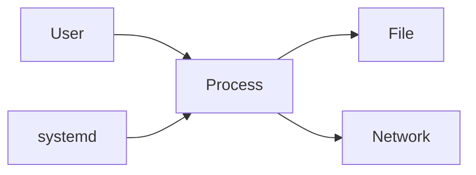

# Linux — Run, inspect, and fix a Linux machine

| | |
|---|---|
| Levels | Beginner → Intermediate → Production |
| Time | Beginner ~25 min · full module ~3h |
| Prerequisites | A Linux shell (Ubuntu 22.04+ / Debian / WSL2) with sudo |
| You will be able to | (1) explain user vs process vs file vs service (2) find why a service is down from logs (3) fix a permission or full-disk failure |

**Last verified:** 2026-08-16 · **Tested with:** Ubuntu 22.04 / 24.04

## 60-second overview

Linux is the operating system your VMs, containers, and CI runners actually boot. You debug it by asking four questions: *who* is this (user), *what is running* (process / service), *what can it touch* (file permissions, disk space), and *what did it just say* (logs). This module teaches those four, on a laptop, with no extra packages.

## Mental model

Linux is a building: users have keys (permissions), processes are people doing work, files are rooms, and systemd is the front desk that starts and restarts services.



## Skip to

| Band | What you get | Go |
|---|---|---|
| Beginner | Concepts + first success | [below](#beginner-core-concepts) |
| Intermediate | Worked examples, comparisons | [below](#intermediate-go-deeper) |
| Production | Security, scale, real constraints | [below](#production) |

## Beginner: core concepts

### Users, groups, and the permission triad

- **What it is:** Every file has an owner, a group, and a mode made of `r`/`w`/`x` for owner, group, and other. That triad is what `ls -l` prints (`-rw-r--r--`).
- **Why it exists:** The kernel needs a yes/no answer to “may this process open this file?” without asking you each time.
- **How it looks:** `ls -l notes.txt` then `chmod 600 notes.txt`. `600` is owner `rw`, group none, other none. `id` shows your uid and groups.
- **Common confusion:** `x` on a *directory* means “you may enter it and resolve names inside,” not “execute the folder.” `chmod 777` is not a fix; it is how you give every account on the box write access.

### The filesystem as a tree; everything is a file

- **What it is:** One tree rooted at `/`. Disks are mounted onto directories. Devices, sockets, and `/proc` entries are also files: the kernel lets you `open` them.
- **Why it exists:** One set of tools (`ls`, `cat`, `chmod`) works on disks, logs, and device nodes.
- **How it looks:** `ls -l /` then `pwd`. Your work for this module lives under `/tmp/linux-lab` so a reboot can wipe it.
- **Common confusion:** “Everything is a file” does not mean “only regular files exist.” A directory is a file. `/dev/sda` is a file. `/proc/1/status` is a file. You still use `df` for disks and `ps` for processes.

### Processes (PID, parent, signals)

- **What it is:** A running program. The kernel gives it a PID, a parent PID, a user, and a current directory. You ask it to stop with a [signal](https://man7.org/linux/man-pages/man7/signal.7.html): `SIGTERM` (15) means “please exit”; `SIGKILL` (9) means “die now.”
- **Why it exists:** Almost every outage is “a process is not running,” “a process is stuck,” or “too many processes.”
- **How it looks:** `ps aux | head` and `ps -u "$USER"`. `kill PID` sends TERM; `kill -9 PID` is last resort.
- **Common confusion:** Killing a process is not the same as stopping a systemd service. If the service is `enabled` and `Restart=` is set, systemd will start it again.

### systemd services

- **What it is:** systemd is the first process (PID 1) on Ubuntu. A *service* is a unit file that says how to start a long-running process and what to do if it dies.
- **Why it exists:** You should not start nginx from a forgotten `nohup` in a tmux session. The front desk starts it on boot and restarts it after a crash.
- **How it looks:** `systemctl status ssh` (or `ssh.service`). `systemctl start|stop|restart NAME`. `enable` means “on boot,” not “right now.”
- **Common confusion:** `enable` ≠ `start`. A unit can be enabled and still `failed`. Always read `systemctl status` and the journal before editing the unit file.

### Networking basics: interfaces and listening ports

- **What it is:** An *interface* is a network attachment (`eth0`, `ens3`, `lo`). A *listening port* is a process waiting for connections. `ip` shows addresses; `ss` shows sockets.
- **Why it exists:** “I cannot reach the app” is either “this host has no address,” “nothing is listening,” or “something else is bound to that port.”
- **How it looks:** `ip addr` and `ss -tuln`. `-tuln` is TCP/UDP, listening, numeric (no DNS).
- **Common confusion:** `127.0.0.1` is *this* machine. `ss` replaced `netstat` on modern Ubuntu; if `ss` is missing, install `iproute2`.

### Logs: journalctl vs /var/log

- **What it is:** systemd units write to the *journal* (`journalctl`). Classic daemons also write files under `/var/log` (nginx access logs, apt history).
- **Why it exists:** You cannot fix a service you cannot hear. The journal is indexed by unit and time; files are easier to `tail` and ship.
- **How it looks:** `journalctl -n 20 --no-pager` and `journalctl -u ssh -e --no-pager`. Then `ls /var/log`.
- **Common confusion:** An empty journal after reboot often means journald is storing only in memory (`/run/log/journal`). That is a persistence setting, not “Linux has no logs.”

## Beginner: first success

**Goal:** Prove you can identify yourself, create a file, lock its mode, list processes and listening ports, and read the journal.  
**Time:** ~15 minutes. No extra packages.

```bash
whoami
id
uname -a
pwd
ls -l /
mkdir -p /tmp/linux-lab && cd /tmp/linux-lab
echo "hello" > notes.txt
ls -l notes.txt
chmod 600 notes.txt
ls -l notes.txt
ps aux | head
ss -tuln | head
journalctl -n 20 --no-pager
df -h
```

**Expected output:** The second `ls -l notes.txt` shows `-rw-------` (mode `600`). `ss` prints a header and at least one listening socket (`127.0.0.1:22` or similar). `journalctl` prints recent lines. `df -h` shows at least `/` with a Use% column. Usernames, kernel strings, and port lists differ by machine.

**If it failed:**

- `journalctl: No journal files were found` or permission denied → you are not in group `adm`. Use `sudo journalctl -n 20 --no-pager`, or `sudo usermod -aG adm "$USER"` and log out and back in.
- `ss: command not found` → `sudo apt install -y iproute2`.
- `df` shows 100% on `/` → stop here and go to [Pitfalls](#pitfalls). Nothing else will work well until you free space.

## Intermediate: go deeper

### sudo and [least privilege](../docs/GLOSSARY.md#least-privilege)

`sudo` runs one command as root. Membership in the `sudo` group on Ubuntu is a blank check. Prefer a user that can only do the jobs they have.

- `sudo -l` — what *you* are allowed to run.
- `sudo visudo` — edit `/etc/sudoers` safely (it syntax-checks on save). Drop-in files live in `/etc/sudoers.d/`.
- Adding a human to the sudo group is the [create-sudo-user.sh](./examples/create-sudo-user.sh) example. Read it before you run it. The basic exercise below creates `learner` *without* that group.

### Package managers: apt (and dnf)

Ubuntu/Debian use `apt`. Fedora/RHEL use `dnf`. Same job: install and upgrade packages from a repository.

```bash
sudo apt update
sudo apt install -y curl
apt show curl | head
```

`dnf install -y curl` is the Fedora equivalent. Do not mix them. `apt update` refreshes the index; `apt upgrade` installs newer versions. On a laptop, update before you install.

### Disk: `df` and `du`

- `df -h` — how full is each *mount*? Start here when you see `No space left on device`.
- `du -xh -d 1 /var 2>/dev/null` — which directory under `/var` is large? Then go one level deeper.

A full disk makes `apt`, logging, and editors fail in confusing ways. [disk-alert.sh](./examples/disk-alert.sh) turns `df` into a one-line ALERT when any real filesystem is over 80% full:

```bash
chmod +x examples/disk-alert.sh
THRESHOLD=0 ./examples/disk-alert.sh   # force an ALERT so you can see the format
./examples/disk-alert.sh               # silent unless something is actually over 80%
```

### Firewall: ufw, short version

`ufw` is Ubuntu’s wrapper around nftables. Default policy on a fresh VM should be deny incoming, then allow what you need.

```bash
sudo ufw allow 22/tcp
sudo ufw allow 80/tcp
sudo ufw status
# sudo ufw enable   # only after 22/tcp is allowed if you are on SSH
```

Do not `ufw enable` on a remote box until `22/tcp` is allowed. Keep this to those two ports until you have a reason for more.

### Comparison

| Reach for this | When |
|---|---|
| `journalctl -u NAME` | The process is a systemd service and you want the crash that just happened |
| A file under `/var/log` | The daemon writes its own log (nginx access, apt `history.log`) or you are shipping files |
| `df` then `du` | Writes fail, or `disk-alert.sh` printed ALERT |
| `ss -tulpn` | “Connection refused” vs “already in use” |

## Production

**You should already be able to:** create a user, read `journalctl`, see listening ports, explain `rwx`.

### Disable root SSH; use keys

Log in as a normal user and `sudo`. In `/etc/ssh/sshd_config` or a file under `/etc/ssh/sshd_config.d/`:

- `PermitRootLogin no` — root has no password prompt on the network.
- `PasswordAuthentication no` — only after your public key is in that user’s `~/.ssh/authorized_keys`.
- Then `sudo systemctl reload ssh` (Ubuntu 24.04) or `ssh.service`.

Keep a console session open and test a *new* SSH login before you close the old one. Do not turn passwords off until a key login has worked.

### Unattended upgrades

`unattended-upgrades` applies security updates without you logging in. On Ubuntu: `sudo apt install -y unattended-upgrades`. The default config is enough to start. Kernel updates still need a reboot (or a livepatch service you add later). Check `/var/log/unattended-upgrades/` when “the box updated itself.”

### Why Ansible later

Once you have more than a handful of machines, repeating `useradd` and `sshd_config` by hand is how drift starts. [Ansible](../08-ansible/README.md) turns those steps into a playbook. Learn them by hand first so you can read what the playbook changed. Do not start this module by automating it.

### journald persistence

By default some systems keep the journal only in `/run/log/journal` (RAM). Reboot, and the evidence is gone. Persist it:

```bash
sudo mkdir -p /var/log/journal
sudo systemd-tmpfiles --create --prefix /var/log/journal
sudo systemctl restart systemd-journald
```

Or set `Storage=persistent` in `/etc/systemd/journald.conf` and restart `systemd-journald`. Confirm with `journalctl --disk-usage`.

### ACLs, one paragraph

The `rwx` triad is owner, one group, everyone else. If alice and bob both need write and they should not share a group, use an ACL: `setfacl -m u:bob:rw file` and `getfacl file`. Most day-to-day work stays on `chmod`/`chown`. Reach for ACLs when the triad would force you to create a throwaway group or open the file to *other*.

## Pitfalls

| Symptom | Likely cause | Fix |
|---|---|---|
| `Permission denied` | Wrong owner, mode, or you are not in the group | `ls -l` and `id`; then `chmod`/`chown` or add the user to the group. Do not `chmod 777`. |
| Service `failed` or `inactive (dead)` | Unit crashed, never started, or a dependency is down | `systemctl status NAME` then `journalctl -u NAME -e --no-pager` |
| `No space left on device` | A filesystem at 100% | `df -h` to find the mount; `sudo du -xh -d 1 / 2>/dev/null` and go down. Rotate or delete logs; do not reboot and hope. |
| `Address already in use` | Another process is bound to that port | `ss -tulpn \| grep :PORT` then stop that service or pick another port |

## How this connects

- **Previous:** none — this is the first module.
- **Next:** [Git](../02-git/README.md) to record the files you just learned to create. Then [Docker](../03-docker/README.md) to package an app, and [Ansible](../08-ansible/README.md) to repeat the setup you just did by hand.
- **When not to use this:** Do not SSH into every box to “just fix it” once you have more than a handful. That is why Ansible exists.

## Practice

Full write-ups (setup, task, hint, success, solution notes) live under [exercises/](./exercises/).

| # | Band | Exercise |
|---|---|---|
| 1 | Basic | [Create a login user without sudo](./exercises/01-basic-user.md) |
| 2 | Basic | [List your processes](./exercises/02-basic-processes.md) |
| 3 | Intermediate | [Force a disk alert](./exercises/03-intermediate-disk-alert.md) |
| 4 | Production | [Name five hardening steps](./exercises/04-production-hardening.md) |

## Cheat sheet

Command index: [cheatsheet.md](./cheatsheet.md).

## Official documentation

- [Start here: Ubuntu Server docs](https://ubuntu.com/server/docs) — the distro this module tests on; users, ssh, and ufw are there.
- [Deep reference: Linux man pages](https://man7.org/linux/man-pages/) — `man chmod`, `man systemd`, `man journalctl`.
- [Deep reference: systemd](https://www.freedesktop.org/software/systemd/man/latest/) — unit files and `journald.conf`.
