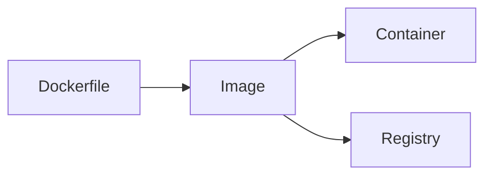

# Docker — Package an app and its dependencies into an image

| | |
|---|---|
| Levels | Beginner → Intermediate → Production |
| Time | Beginner ~25 min · full module ~3h |
| Prerequisites | [Linux](../01-linux/README.md) first success; Docker Engine or Desktop |
| You will be able to | (1) explain [image](../docs/GLOSSARY.md#image) vs [container](../docs/GLOSSARY.md#container) vs [layer](../docs/GLOSSARY.md#layer-docker) (2) write a small Dockerfile and run it (3) say when Compose is better than a long `docker run` |

**Last verified:** 2026-08-16 · **Tested with:** Docker Engine 27.x / 28.x

## 60-second overview

Docker packages an app and the libraries it needs into an *image*, then runs a copy of that image as a *container*. The host kernel is shared; the filesystem and process list are not. You use it so “works on my laptop” and “works on the server” are the same filesystem, not two slightly different apt installs.

## Mental model

An image is a sealed lunchbox; a container is someone eating from a copy of that lunchbox. Layers are ingredients stacked so two lunchboxes can share the bread.



## Skip to

| Band | What you get | Go |
|---|---|---|
| Beginner | Concepts + first success | [below](#beginner-core-concepts) |
| Intermediate | Worked examples, comparisons | [below](#intermediate-go-deeper) |
| Production | Security, scale, real constraints | [below](#production) |

## Beginner: core concepts

### Image vs container

- **What it is:** An [image](../docs/GLOSSARY.md#image) is an immutable filesystem snapshot plus a default command. A [container](../docs/GLOSSARY.md#container) is a running (or stopped) instance of that image.
- **Why it exists:** You build the image once, run it many times, and throw the container away. State you care about does not live in the container.
- **How it looks:** `docker run --rm -d --name web -p 8080:80 nginx:1.27-alpine` starts a container from the `nginx:1.27-alpine` image. `--rm` deletes the container on stop.
- **Common confusion:** Deleting a container does not delete the image. `docker ps` is running containers; `docker images` is images.

### Dockerfile

- **What it is:** A text file of instructions that produce an image. Typical first three: `FROM` (base image), `COPY` (your files), `CMD` (what to run).
- **Why it exists:** So the image is reproducible. “I apt-installed it by hand inside a container” is not a build.
- **How it looks:** [examples/hello-static/Dockerfile](./examples/hello-static/Dockerfile) — two lines: start from nginx, copy [index.html](./examples/hello-static/index.html).
- **Common confusion:** The Dockerfile does not run your app. `docker build` produces an image; `docker run` starts a container from it.

### Layers and cache

- **What it is:** Each Dockerfile instruction usually becomes one [layer](../docs/GLOSSARY.md#layer-docker), a filesystem diff. Docker reuses a layer when the instruction and every layer above it are unchanged.
- **Why it exists:** Rebuilds stay fast, and ten images that start `FROM nginx:1.27-alpine` share that base on disk.
- **How it looks:** Put the lines that change least first (`FROM`, `COPY package.json`, `RUN npm ci`) and your source last. `docker build` prints `CACHED` on reused steps.
- **Common confusion:** `COPY . .` early in the file busts the cache on every edit, including README typos. That is what [`.dockerignore`](./examples/hello-static/.dockerignore) is for.

### Ports and localhost publishing (`-p`)

- **What it is:** A process in a container listens on a *container* port. `-p 8080:80` publishes host port 8080 to container port 80.
- **Why it exists:** Containers have their own network namespace. Without `-p` (or Compose `ports:`), only other containers on the same network can connect.
- **How it looks:** `curl http://127.0.0.1:8080` hits the host port. Inside the container the process still sees `:80`.
- **Common confusion:** Publishing is not a firewall hole on another machine by itself, but `0.0.0.0:8080` is reachable from other hosts on your LAN. `localhost` *inside* the container is the container, not your laptop.

### Volumes vs bind mounts (light)

- **What it is:** A [volume](../docs/GLOSSARY.md#volume) is Docker-managed storage. A *bind mount* is a path on the host, mounted into the container.
- **Why it exists:** Container filesystems are thrown away. Databases and your source tree need to outlive `docker rm`.
- **How it looks:** [examples/docker-compose.yml](./examples/docker-compose.yml) bind-mounts `./hello-static` onto nginx’s html directory. Edit `index.html` on the host; nginx serves the new file.
- **Common confusion:** A bind mount hides whatever the image had at that path. Named volumes are better for database data; bind mounts are better for “I am editing this directory.”

## Beginner: first success

**Goal:** Run an official image on localhost, then build and run the static example.  
**Time:** ~15 minutes.

If `docker version` fails with `permission denied` while talking to `/var/run/docker.sock`, your user is not in the `docker` group. On Ubuntu: `sudo usermod -aG docker "$USER"`, then log out and back in. If Docker is not installed, use [Docker Engine](https://docs.docker.com/engine/install/) (or Desktop). The Engine convenience script is the laptop path: `curl -fsSL https://get.docker.com | sh`.

```bash
docker version
docker run --rm -d --name web -p 8080:80 nginx:1.27-alpine
curl -s -o /dev/null -w "%{http_code}\n" http://127.0.0.1:8080
docker logs web --tail 5
docker stop web
```

Then, from this module directory (`03-docker/`):

```bash
cd examples/hello-static
docker build -t hello-static:1 .
docker run --rm -d --name hello -p 8081:80 hello-static:1
curl -s http://127.0.0.1:8081
docker stop hello
```

**Expected output:** `docker version` prints a Client and a Server section. The first `curl` prints `200`. `docker logs web` shows a GET to `/`. The second `curl` prints the `hello-static` heading from [index.html](./examples/hello-static/index.html).

**If it failed:**

- `port is already allocated` → something else owns 8080 or 8081. Use `-p 8088:80` (and curl that host port).
- `Cannot connect to the Docker daemon` → Engine is not running, or you are not in the `docker` group (see above).
- `curl: (7) Failed to connect` right after `docker run` → wait one second and retry; nginx was still starting.

## Intermediate: go deeper

### Compose instead of a long `docker run`

[examples/docker-compose.yml](./examples/docker-compose.yml) starts nginx and bind-mounts [hello-static](./examples/hello-static/index.html) into the html directory. From `03-docker/examples/`:

```bash
docker compose up -d
curl -s http://127.0.0.1:8082
docker compose logs --tail 5
docker compose down
```

Compose is the right tool when you are tired of retyping `-p` and `-v`, or when a second service (a database, a cache) needs to share a network with the app.

### `.dockerignore`

[examples/hello-static/.dockerignore](./examples/hello-static/.dockerignore) keeps `.git` and markdown out of the build context. Without it, `COPY . .` sends everything in the directory to the daemon — including secrets and `node_modules`. Treat it like `.gitignore` for `docker build`.

### logs, exec, inspect

```bash
docker logs hello --tail 20
docker exec hello ls /usr/share/nginx/html
docker inspect hello --format '{{.State.Status}} {{.NetworkSettings.IPAddress}}'
```

`logs` is stdout/stderr of PID 1 in the container. `exec` runs an extra process in that container (the container must still be running). `inspect` is the full JSON; `--format` pulls one field.

### Comparison

| Reach for a Dockerfile when… | Reach for Compose when… | Reach for Kubernetes when… |
|---|---|---|
| You are defining *one* image | You need one command to start an app plus its companions on a laptop (`ports`, bind mounts, a shared network) | You need those containers scheduled, healed, and rolled out across machines — see [Kubernetes](../04-kubernetes/README.md) |

`docker run` is the learning tool and the one-off. It is not how you describe a two-service dev stack.

## Production

**You should already be able to:** run a container, write a 10-line Dockerfile, explain layers.

### Multi-stage builds

A builder stage has compilers and `node_modules`. The final stage copies only the artifact. [examples/multi-stage.Dockerfile](./examples/multi-stage.Dockerfile) compiles a tiny Go HTTP server and copies the one binary into `alpine:3.20`. The same idea in Node is `npm run build` then `COPY --from=builder /app/dist`.

```bash
# from 03-docker/examples/
docker build -f multi-stage.Dockerfile -t hello-multi:1 .
docker run --rm -d --name multi -p 8083:8080 hello-multi:1
curl -s http://127.0.0.1:8083
docker stop multi
```

The final image should not contain `go`, `gcc`, or your test fixtures.

### Non-root `USER`

The last stage of that Dockerfile runs `USER app`. If the process does not need to be root, it should not be. Official nginx already drops the worker to user `nginx`; your own app images often forget `USER` and stay root.

### Pin tags, never `latest`

`nginx:1.27-alpine` is a moving *patch* line, but it is still a pin compared to `nginx:latest`. `latest` on your laptop and `latest` on the server will diverge. Prefer a digest (`nginx@sha256:…`) when you need bit-for-bit reproducibility.

### Read-only rootfs and dropped capabilities (short)

```bash
docker run --rm --read-only --tmpfs /tmp --cap-drop ALL \
  --name hello-ro -p 8081:80 hello-static:1
```

nginx may also need tmpfs mounts for `/var/cache/nginx` and `/run`. `--cap-drop ALL` removes Linux capabilities the process does not need; add back only what it must have (rarely `NET_BIND_SERVICE` if it listens on a port below 1024 *and* is non-root). If the container exits, `docker logs` will tell you which path it tried to write.

### Scan mention

Tools such as [Trivy](https://trivy.dev/) report known CVEs in an image (`trivy image hello-static:1`). You do not need to install a scanner for this module. Make scanning a CI step later in [GitHub Actions](../08-github-actions/README.md), not a ritual you run by hand on every local build.

### `.dockerignore` again

Production images still start with a small context. A forgotten `.env` in the build context is a leaked secret even if you never `COPY` it, because people later change the Dockerfile.

## Pitfalls

| Symptom | Likely cause | Fix |
|---|---|---|
| Image is hundreds of MB for a static page | Fat base, no `.dockerignore`, leftover build tools | Alpine or a multi-stage final image; add [`.dockerignore`](./examples/hello-static/.dockerignore) |
| `permission denied` on `docker.sock` | Your user is not in the `docker` group | `sudo usermod -aG docker "$USER"` then a new login |
| Container exits immediately | PID 1 ended or crashed | `docker logs NAME`; `docker inspect NAME --format '{{.State.ExitCode}}'` |
| `port is already allocated` | Host port is taken | `docker ps` and `ss -tuln`; pick another `-p` |

## How this connects

- **Previous:** [Linux](../01-linux/README.md) — you already know processes, ports (`ss`), and files.
- **Next:** [Kubernetes](../04-kubernetes/README.md) — a Pod runs this image. [GitHub Actions](../08-github-actions/README.md) is where you will `docker build` and push on each git event.
- **When not to use this:** A one-off debug on the host (`journalctl`, `ss`, a local binary) does not need Docker. Do not wrap a single `curl` in an image to look official.

## Practice

Full write-ups (setup, task, hint, success, solution notes) live under [exercises/](./exercises/).

| # | Band | Exercise |
|---|---|---|
| 1 | Basic | [Write a static Dockerfile](./exercises/01-basic-dockerfile.md) |
| 2 | Basic | [Build and publish a host port](./exercises/02-basic-build-run.md) |
| 3 | Intermediate | [Two services with Compose](./exercises/03-intermediate-compose.md) |
| 4 | Production | [Four notes and a read-only run](./exercises/04-production-read-only.md) |

## Cheat sheet

Command index: [cheatsheet.md](./cheatsheet.md).

## Official documentation

- [Start here: What is a container?](https://docs.docker.com/get-started/docker-concepts/the-basics/what-is-a-container/) — image vs container in Docker’s own words.
- [Deep reference: Dockerfile](https://docs.docker.com/reference/dockerfile/) — every instruction.
- [Deep reference: multi-stage builds](https://docs.docker.com/build/building/multi-stage/) — the Production pattern above.
- [Deep reference: Compose file](https://docs.docker.com/reference/compose-file/) — `services`, `ports`, `volumes`.
