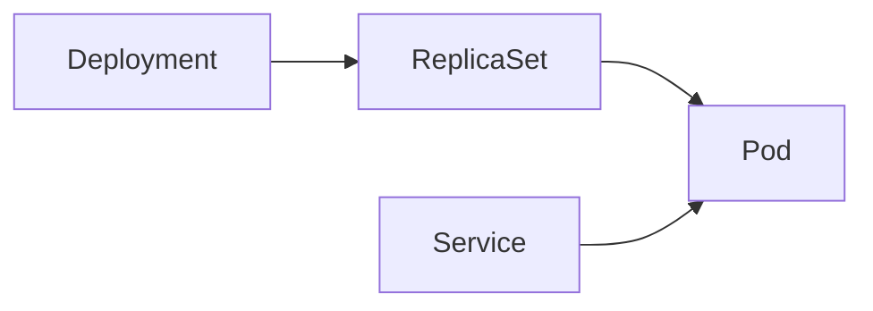

# Kubernetes — Run and heal many containers as one system

| | |
|---|---|
| Levels | Beginner → Intermediate → Production |
| Time | Beginner ~40 min · full module ~6h |
| Prerequisites | [Docker](../03-docker/README.md) first success; `kubectl` + [kind](https://kind.sigs.k8s.io/docs/user/quick-start/) |
| You will be able to | (1) explain [Pod](../docs/GLOSSARY.md) vs [Deployment](../docs/GLOSSARY.md) vs [Service](../docs/GLOSSARY.md) (2) apply YAML on kind and curl the Service (3) use `describe` / `logs` when a Pod is not Ready |

**Last verified:** 2026-08-16 · **Tested with:** Kubernetes 1.31+ via kind, kubectl matching the cluster

The first cluster in this module is **kind**, not kubeadm. kubeadm belongs in [Production](./advanced.md).

## 60-second overview

Kubernetes keeps a declared number of containers running and reachable. You write YAML ([manifests](../docs/GLOSSARY.md)) that say “three copies of this image, behind this name.” The control plane stores that [desired state](../docs/GLOSSARY.md), watches what is actually running, and starts or kills Pods until the two match. That loop is [reconciliation](../docs/GLOSSARY.md).

A laptop cluster is enough to learn the objects. A production cluster is a different problem (certificates, etcd backups, upgrades, networking) and is covered later.

Jargon used more than once is in the [glossary](../docs/GLOSSARY.md). How to study: [How to learn](../docs/HOW_TO_LEARN.md).

## Mental model

A **Pod** is one lunch tray (one or more containers sharing a network). A **Deployment** is the cafeteria manager who keeps N trays out. A **Service** is the menu-board name that stays put while trays come and go.

You edit the Deployment. Kubernetes creates a [ReplicaSet](../docs/GLOSSARY.md), which creates Pods. The Service selects those Pods by [label](../docs/GLOSSARY.md), not by Pod name.

## Skip to

| Band | What you get | Go |
|---|---|---|
| Beginner | Six concepts + kind install + first success (apply, curl, scale) | [beginner.md](./beginner.md) |
| Intermediate | ConfigMap, Ingress, HPA, requests/limits, namespaces, kubectl | [intermediate.md](./intermediate.md) |
| Production | Requests required, NetworkPolicy, RBAC, Helm/Kustomize, real clusters | [advanced.md](./advanced.md) |

## Files in this module

| File | Used in |
|---|---|
| [examples/nginx-deployment.yaml](./examples/nginx-deployment.yaml) | Beginner first success — 3 replicas of `nginx:1.27-alpine` |
| [examples/nginx-service.yaml](./examples/nginx-service.yaml) | Beginner first success — ClusterIP on port 80 |
| [examples/configmap.yaml](./examples/configmap.yaml) | Intermediate — ConfigMap injected as env |
| [examples/rbac-example.yaml](./examples/rbac-example.yaml) | Production — Role + RoleBinding + ServiceAccount |
| [cheatsheet.md](./cheatsheet.md) | Command and object reference |

## Pitfalls

| Symptom | Likely cause | Fix |
|---|---|---|
| `ImagePullBackOff` | Image name or tag wrong, or the node cannot reach the registry | `kubectl describe pod <name>` → Events. Fix the tag. On kind, confirm Docker can pull the same image. |
| `CrashLoopBackOff` | Process inside the container exits | `kubectl logs <name>` and `kubectl describe pod <name>`. Fix the command, config, or missing file. |
| Pod stays `Pending` | No node has enough CPU/memory, or a taint the Pod does not tolerate | `kubectl describe pod <name>` → Events (`FailedScheduling`). Lower requests, or free the node. |
| Service has no endpoints | Selector does not match Pod labels | `kubectl get pods --show-labels` and `kubectl get endpoints nginx`. Align `spec.selector` with the Pod template labels. |
| DNS name does not resolve inside the cluster | CoreDNS not Ready, or you used the wrong name | `kubectl get pods -n kube-system`. From another Pod the name is `nginx.default.svc.cluster.local` (Service `nginx` in namespace `default`). |
| `kubectl edit pod` rejects the change | Most Pod spec fields are immutable | Edit the Deployment (`kubectl edit deploy/nginx` or change the YAML and `kubectl apply`). |

## How this connects

- **Previous:** [Docker](../03-docker/README.md) — the image is what the Pod runs. If you cannot `docker run` the image, Kubernetes will not run it either.
- **Next:** [GitHub Actions](../08-github-actions/README.md) is how you build and deploy the image; [Prometheus](../06-prometheus/README.md) is how you watch what you shipped.
- **When not to use this:** One container on a laptop is Docker Compose, not a cluster. Do not stand up Kubernetes to run a single process you can `docker run`.

## Practice

Do these from `04-kubernetes/` so the `examples/` paths work.

### Basic

1. **Setup:** kind cluster `learn` from [first success](./beginner.md#beginner-first-success).  
   **Task:** Apply [examples/nginx-deployment.yaml](./examples/nginx-deployment.yaml) and [examples/nginx-service.yaml](./examples/nginx-service.yaml). Scale to 5 replicas, wait until 5 are Ready, scale back to 3.  
   **Hint:** `kubectl scale deploy/nginx --replicas=5` then `kubectl get pods -w`.  
   **Success:** `kubectl get deploy nginx` shows `3/3` READY after you scale back.

2. **Setup:** Same cluster.  
   **Task:** Apply [examples/configmap.yaml](./examples/configmap.yaml). Exec into the `config-demo` Pod and print `APP_COLOR`.  
   **Hint:** `kubectl exec deploy/config-demo -- env \| grep APP_`  
   **Success:** Output includes `APP_COLOR=blue`.

### Intermediate

3. **Setup:** First-success Deployment and Service are applied.  
   **Task:** Write an Ingress YAML that sends `/` to Service `nginx` on port 80. Apply it. Explain why `curl` to that Ingress does not work on this kind cluster yet.  
   **Hint:** An Ingress object is data. A controller is a running Pod that reads it. kind does not install one for you.  
   **Success:** `kubectl get ingress` shows your object, and you can name “no Ingress controller” as the reason traffic does not flow.

### Production

4. **Setup:** Same cluster.  
   **Task:** Apply [examples/rbac-example.yaml](./examples/rbac-example.yaml). Prove the `log-reader` ServiceAccount can list Pods and cannot delete them.  
   **Hint:** `kubectl auth can-i` with `--as=system:serviceaccount:default:log-reader`.  
   **Success:** `get pods` is `yes`; `delete pods` is `no`.

Solution sketches

1. `kubectl apply -f examples/nginx-deployment.yaml -f examples/nginx-service.yaml` then the two `kubectl scale` commands from [beginner.md](./beginner.md).
2. `kubectl apply -f examples/configmap.yaml` then `kubectl exec deploy/config-demo -- env | grep APP_`.
3. Copy the Ingress snippet in [intermediate.md](./intermediate.md). `kubectl get pods -A` will not show an ingress-nginx (or similar) controller unless you installed one.
4. After apply: `kubectl auth can-i get pods --as=system:serviceaccount:default:log-reader` and the same for `delete`.

## Cheat sheet

[cheatsheet.md](./cheatsheet.md) — kind, apply/get/describe/logs, scale, rollout, port-forward, `auth can-i`.

## Official documentation

- [Start here: kind Quick Start](https://kind.sigs.k8s.io/docs/user/quick-start/) — laptop cluster used in this module
- [Start here: kubectl install](https://kubernetes.io/docs/tasks/tools/) — the client, not the cluster
- [Deep reference: Kubernetes concepts](https://kubernetes.io/docs/concepts/) — objects after you have applied one Deployment
- [Deep reference: kubectl cheat sheet](https://kubernetes.io/docs/reference/kubectl/quick-reference/) — flags this page does not list
