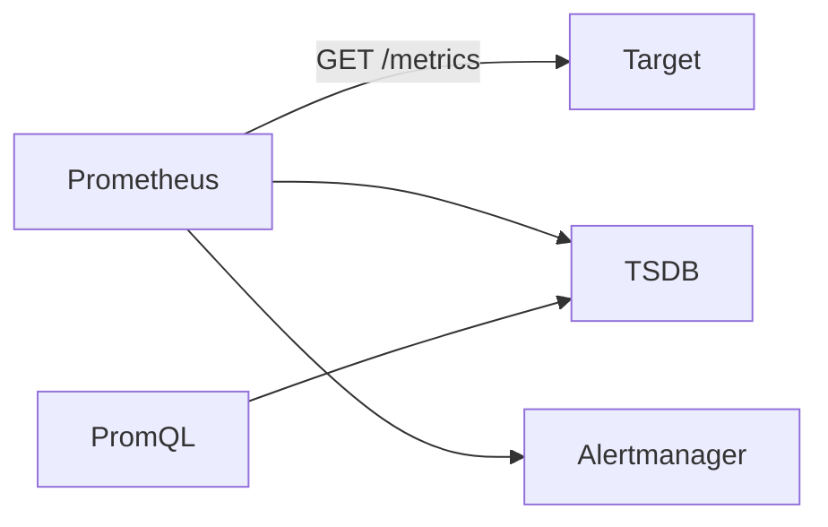

# Prometheus — Pull metrics on a timer and ask questions of them

| | |
|---|---|
| Levels | Beginner → Intermediate → Production |
| Time | Beginner ~30 min · full module ~4h |
| Prerequisites | [Docker](../03-docker/README.md) first success. [Kubernetes](../04-kubernetes/README.md) only for the Intermediate ServiceMonitor path. |
| You will be able to | (1) explain scrape, time series, and the four metric types (2) run Prometheus in Docker and open `/graph` (3) write a PromQL `rate()` query |

**Last verified:** 2026-08-16 · **Tested with:** Prometheus 2.54+ / 3.x in Docker

## 60-second overview

Prometheus [scrapes](../docs/GLOSSARY.md) HTTP endpoints on a timer, stores each sample as a [time series](../docs/GLOSSARY.md), and lets you ask questions in [PromQL](../docs/GLOSSARY.md). It does not wait for apps to push (except short jobs via Pushgateway). [Alerts](../docs/GLOSSARY.md) are *evaluated* here and *delivered* by Alertmanager. Graphs usually live in [Grafana](../07-grafana/README.md).

## Mental model

Prometheus is a clerk who walks a list of desks every 15 seconds, copies the numbers on each whiteboard into a notebook, and lets you ask the notebook questions. It does not wait for the desks to call.



## Skip to

| Band | What you get | Go |
|---|---|---|
| Beginner | Concepts + first success in Docker | [below](#beginner-core-concepts) |
| Intermediate | Rules, Alertmanager, ServiceMonitor | [below](#intermediate-go-deeper) |
| Production | Cardinality, Helm Operator stack, SLI/SLO | [below](#production) |

## Beginner: core concepts

### Pull / scrape model

- **What it is:** Prometheus does an HTTP GET on each target’s `/metrics` on a schedule. That GET is a [scrape](../docs/GLOSSARY.md). This is the [pull model](../docs/GLOSSARY.md).
- **Why it exists:** The server knows who should be up. A missing scrape *is* a signal (`up == 0`). You do not open inbound holes on Prometheus for every app.
- **How it looks:** A job in [examples/docker/prometheus.yml](./examples/docker/prometheus.yml) lists `localhost:9090`. Every `scrape_interval` (15s here) Prometheus fetches that URL.
- **Common confusion:** This is not logs and not traces. A scrape copies *numbers*. Apps that die in under one interval (batch jobs) need Pushgateway; long-running services do not.

### Time series + labels

- **What it is:** A series is a metric name plus a set of [labels](../docs/GLOSSARY.md): `http_requests_total{job="api", code="200"}`. Each scrape appends one sample `(timestamp, value)` to the [TSDB](../docs/GLOSSARY.md).
- **Why it exists:** The same metric from many jobs stays one name. You slice later with label matchers, not by inventing a new metric per instance.
- **How it looks:** `up{job="prometheus", instance="localhost:9090"} 1`
- **Common confusion:** Labels are identity, not metadata you can attach freely. A new label *value* is a new series forever. See [cardinality](../docs/GLOSSARY.md) in Production.

### Four metric types

- **What they are:**
  - **Counter** — only goes up (or resets on restart). Request counts, bytes sent. You almost always wrap it in `rate()`.
  - **Gauge** — goes up and down. Heap size, `up`, queue depth. Graph it raw.
  - **Histogram** — observations in buckets (`_bucket`, `_sum`, `_count`). Use it when you need a percentile later (`histogram_quantile`).
  - **Summary** — client-side quantiles. Use it only when you cannot afford histograms; you cannot aggregate summaries across instances.
- **Why they exist:** PromQL functions assume a type. `rate()` on a gauge is usually wrong; a raw counter looks like a staircase, not a request rate.
- **How it looks:** The `/metrics` page itself: `# TYPE http_requests_total counter` then `http_requests_total{code="200"} 12`.
- **Common confusion:** “I need p99” does not mean Summary. Start with a Histogram. CPU/memory queries like `container_cpu_usage_seconds_total` need cAdvisor or Kubernetes — they will be empty in this Docker first success.

### PromQL as questions, not SQL

- **What it is:** [PromQL](../docs/GLOSSARY.md) selects series and computes over time ranges. Instant vectors (`up`) and range vectors (`up[5m]`) are different types.
- **Why it exists:** You care about “errors per second over the last five minutes,” not a JOIN.
- **How it looks:** `rate(prometheus_http_requests_total[5m])` — “how fast is this counter climbing, averaged over 5 minutes?”
- **Common confusion:** There is no `SELECT *`. Start from a metric name, then filter `{job="prometheus"}`, then apply a function. `rate()` takes a *range* vector (`[5m]`), not a bare counter.

### Alerting is separate

- **What it is:** A rule on the Prometheus server becomes an [alert](../docs/GLOSSARY.md) when its expression stays true long enough (`for:`). Alertmanager groups, silences, and routes that alert (Slack, email, PagerDuty).
- **Why it exists:** Evaluation (“is this bad?”) is next to the data. Notification (“who gets woken?”) is a different problem — retries, grouping, quiet hours.
- **How it looks:** [examples/prometheus-rule.yaml](./examples/prometheus-rule.yaml) is the rule; [examples/alertmanager-config.yaml](./examples/alertmanager-config.yaml) is the router. First success does not run either.
- **Common confusion:** A red line on a graph is not an alert. Grafana can also alert (next module). Pick one path per signal so you are not paged twice.

## Beginner: first success

**Goal:** Run Prometheus in Docker, scrape itself, open `/graph`, and run `up`.  
**Time:** ~15 minutes

You need Docker Engine (or Desktop) and this repo. Work from the compose directory so the bind mount `./prometheus.yml` resolves.

```bash
cd examples/docker
docker compose up -d
```

Open [http://localhost:9090](http://localhost:9090). Use **Graph** (Prometheus 3: **Query**) and **Status → Targets**.

In the expression box, run these one at a time, Execute:

```promql
up
prometheus_build_info
rate(prometheus_http_requests_total[5m])
```

Click around the UI (Targets, the graph, `/metrics`) so `prometheus_http_requests_total` has samples. `rate()` needs a few scrapes; wait at least one `scrape_interval` (15s), preferably a minute.

**Expected output:**

- **Status → Targets** shows job `prometheus`, target `localhost:9090`, state **UP**.
- Graph of `up` is a flat line at `1`.
- `prometheus_build_info` returns one series with version labels.
- `rate(prometheus_http_requests_total[5m])` returns one or more lines (values near 0 are fine on a quiet lab).

**If it failed:**

| What you see | Fix |
|---|---|
| `Bind for 0.0.0.0:9090 failed` | Something else owns 9090 (another compose stack, a local Prometheus). Stop it, or change the host port to `"9091:9090"`. |
| Container starts, Targets empty or YAML error in logs | You ran compose from the wrong directory. The volume is `./prometheus.yml` — must be [examples/docker/prometheus.yml](./examples/docker/prometheus.yml). |
| Target **DOWN** | Wait 15s and refresh. Then `docker compose logs prometheus`. A bad indent in `prometheus.yml` prevents reload. |
| `rate(...)` is empty | Not enough samples yet, or the counter name is wrong. Confirm `prometheus_http_requests_total` in the graph first. |

Stop later with `docker compose down` from the same directory. If you will immediately do [Grafana](../07-grafana/README.md), stop this stack first — that module starts its own Prometheus on 9090.

## Intermediate: go deeper

### Recording rules and alerting rules

A [recording rule](../docs/GLOSSARY.md) precomputes a PromQL expression and stores the result as a new series. Use it for expensive queries you graph every 30 seconds. An alerting rule is the same machinery with `alert:` instead of `record:`.

[examples/prometheus-rule.yaml](./examples/prometheus-rule.yaml) is a **Prometheus Operator** `PrometheusRule` (a [CRD](../docs/GLOSSARY.md)), not a file you mount into Docker Prometheus. The inner rule in English:

- **HighErrorRate** — for each `job`, take the 5-minute rate of HTTP requests whose `status` matches `5xx`, divide by the 5-minute rate of *all* requests. If that ratio stays **above 5% for 5 minutes**, fire a **critical** alert. The annotation text includes `{{ $labels.job }}` so the page names the job.

A native Prometheus rules file is the same `groups:` list without the Kubernetes wrapper. You would mount it and add `rule_files:` to `prometheus.yml`. The Operator version exists because on Kubernetes you do not want to hand-edit the server’s config for every new alert.

This rule stays silent until something exposes `http_requests_total`. The Docker first success does not.

CPU and memory queries you will see in cluster docs need cAdvisor / kubelet metrics, not this lab:

```promql
sum(rate(container_cpu_usage_seconds_total[5m])) by (pod)
container_memory_usage_bytes{pod=~"my-app.*"}
sum(rate(http_requests_total{status=~"5.."}[5m]))
  / sum(rate(http_requests_total[5m]))
```

### Alertmanager

[examples/alertmanager-config.yaml](./examples/alertmanager-config.yaml) is native Alertmanager config:

- **`group_by: [alertname]`** — one thread per alert name, not per instance.
- **`group_wait: 30s`** — wait for siblings before the first send, so a flap does not page.
- **`repeat_interval: 12h`** — remind if it is still firing.
- **`receiver: slack-notifications`** — posts to a Slack webhook. The URL in the file is a placeholder; a real webhook is a secret, not something to commit.

Prometheus sends alerts to Alertmanager over HTTP. If Alertmanager is down, rules still evaluate; nobody is notified.

### Instrumenting an app

An [exporter](../docs/GLOSSARY.md) translates someone else’s stats (a database, the node) into the scrape format. Your own app should expose `/metrics` with a client library (Go, Java, Python, Ruby are first-party).

What Prometheus actually reads is text:

```text
# HELP http_requests_total Total HTTP requests
# TYPE http_requests_total counter
http_requests_total{code="200",path="/health"} 12
http_requests_total{code="500",path="/health"} 1
```

Do not put `user_id` or a raw URL with ids on those labels. See Production.

### ServiceMonitor (Kubernetes, needs the Operator)

[examples/servicemonitor.yaml](./examples/servicemonitor.yaml) does nothing to Docker Prometheus. A [ServiceMonitor](../docs/GLOSSARY.md) is a CRD the Prometheus Operator watches. It means: find [Services](../docs/GLOSSARY.md) labeled `app: my-app`, scrape the port named `metrics` at `/metrics` every 30s.

The `release: prometheus` label is how the `kube-prometheus-stack` Prometheus decides *which* ServiceMonitors to honor. Wrong label → silent miss, not an error. You need the Operator (Production Helm install) and a cluster from the [Kubernetes](../04-kubernetes/README.md) module.

### Docker Compose vs kube-prometheus-stack

| Reach for Compose when… | Reach for kube-prometheus-stack when… |
|---|---|
| You are learning scrape, PromQL, and `/graph` on a laptop | You need cluster metrics, ServiceMonitors, and a bundled Grafana |
| Targets are a static list in `prometheus.yml` | Targets come and go with Pods |
| One process, one disk, you edit a file | An Operator rebuilds scrape config from CRDs |

## Production

**You should already be able to:** get Targets **UP**; run `up` and a `rate()` query; explain scrape vs alert vs Grafana; say why ServiceMonitor needs the Operator.

### Cardinality

This is the production lesson that actually hurts. Each unique combination of label *values* is a series Prometheus must index and compact.

```text
http_requests_total{path="/users",code="200"}     # bounded — keep
http_requests_total{user_id="18392",path="..."}   # one series per user — do not
```

A busy user-id label can OOM the process. The same trap: request ids, emails, full URLs, pod names if they churn every deploy *and* you keep them forever. Prefer `code`, `method`, a small set of `path` templates, `job`, `instance`.

### Retention and scrape_interval

Default retention is 15 days (`--storage.tsdb.retention.time`). Faster scrapes and longer retention mean more disk and slower queries. `15s` is the usual scrape; `1s` is almost never worth it. For years of data, do not grow one local TSDB — that is the next paragraph.

### HA, Thanos, Mimir

Two Prometheus servers that scrape the same targets are the usual HA: each has its own disk; they do not replicate. If one dies, you still query the other (or you miss a gap). When one disk is not enough — long retention, many clusters, global queries — people put Thanos or Mimir in front. That is a second system, not a flag. This module does not install them.

### SLI / SLO vs “monitor everything”

An [SLI](../docs/GLOSSARY.md) is a number users feel (success ratio, latency). An SLO is the target for that number. Scraping every inode on every node is not an SLO. Start from “what do we page on?” and work backward to metrics. The five Kubernetes signals worth having once the Operator stack is up:

1. Container restarts (CrashLoopBackOff)
2. CPU / memory vs requests and limits
3. HTTP error rate
4. Node disk pressure
5. Pending Pod count

Those series come from kubelet, kube-state-metrics, and cAdvisor — not from the Docker first success.

### kube-prometheus-stack (Kubernetes install)

Do this only after Targets-in-Docker works, and only on a cluster you already have (kind is enough). This chart is the production-shaped install, not the first one.

```bash
helm repo add prometheus-community https://prometheus-community.github.io/helm-charts
helm repo update

helm install prometheus prometheus-community/kube-prometheus-stack \
  --namespace monitoring \
  --create-namespace
```

It installs Prometheus, Alertmanager, Grafana, node-exporter, and kube-state-metrics, plus the Operator CRDs (`ServiceMonitor`, `PrometheusRule`, …). Grafana’s default password for this chart is often `prom-operator` — that is a chart default, not a beginner password. Change it. Port-forward and auth are in the [Grafana Production](../07-grafana/README.md#production) section.

## Pitfalls

| Symptom | Likely cause | Fix |
|---|---|---|
| Prometheus OOM or queries crawl | High [cardinality](../docs/GLOSSARY.md) (user id, request id, unbounded path) | Drop the label; relabel on scrape; restart with a clean TSDB if it is already huge |
| Metric missing | Wrong job / label selector / ServiceMonitor `release` label | Status → Targets; `curl` the `/metrics` URL; compare Service labels to the ServiceMonitor selector |
| Alert rule fires, nobody notified | Alertmanager down, wrong receiver, or network policy | Check Prometheus → Alertmanager discovery; send a test; read Alertmanager silences |
| Query times out | Huge range + regex `.*` + no recording rule | Narrow time, tighten matchers, record the expensive expression |
| `up` is 0 | Target down, bad path, TLS, or scrape timeout | Targets page shows the last error; fix URL/port, then wait one interval |

## How this connects

- **Previous:** [Docker](../03-docker/README.md) — compose and bind mounts are the first-success path. [Kubernetes](../04-kubernetes/README.md) — only when you reach ServiceMonitor.
- **Next:** [Grafana](../07-grafana/README.md) — same metrics, drawn as dashboards. Stop this compose stack before you start that one (both use port 9090).
- **When not to use this:** Do not scrape logs with Prometheus (use a log system). Do not treat the TSDB as a long-term business warehouse (billing tables, per-user history). Do not start with Helm on a cluster you have not used yet.

## Practice

### Basic

1. **Setup:** Docker running; repo cloned.  
   **Task:** From `examples/docker`, start compose and open Targets.  
   **Hint:** Wait one scrape interval.  
   **Success:** Job `prometheus` is **UP**.

2. **Setup:** UI at http://localhost:9090.  
   **Task:** Execute `up`, `prometheus_build_info`, and `rate(prometheus_http_requests_total[5m])`.  
   **Hint:** `rate()` needs a range vector (`[5m]`), not the bare counter. Click the UI a few times first.  
   **Success:** `up` is `1`; `rate()` returns at least one series.

### Intermediate

3. **Setup:** First success still running.  
   **Task:** Enable the optional `node-exporter` service and the `node` job (comments in the two files under [examples/docker](./examples/docker/)). Recreate the stack. Confirm a second target. Graph `up`.  
   **Hint:** Inside the compose network the target is `node-exporter:9100`, not `localhost:9100`.  
   **Success:** Targets shows `node` **UP**. `up` draws two lines (`job="prometheus"` and `job="node"`).

### Production

4. **Setup:** None required (paper). Optional: a kind cluster if you already have one.  
   **Task:** A teammate proposes `http_requests_total{user_id, path, code}`. Say what breaks and write the label set you would ship. If you have kind, install the Helm chart in Production and list ServiceMonitors — do not start here if Docker Targets are not UP.  
   **Hint:** Unbounded label values become series that never leave the index.  
   **Success:** You reject `user_id`, keep a small bounded set (`code`, templated `path`, `job`), and can name the failure (OOM / slow queries).

<details>
<summary>Solution notes</summary>

1. `cd examples/docker && docker compose up -d` → Status → Targets.  
2. Graph → Execute each expression. Generate a little traffic by refreshing `/graph` and `/metrics`.  
3. Uncomment `node-exporter` in `docker-compose.yml` and the `node` job in `prometheus.yml`. `docker compose up -d`.  
4. Ship `{code, path, job}` (path as `/users/:id`, not the raw URL). `user_id` is cardinality. Helm is optional and is *not* the first install.

</details>

## Cheat sheet

One-page commands and objects: [cheatsheet.md](./cheatsheet.md).

## Official documentation

- [Start here — Getting started](https://prometheus.io/docs/prometheus/latest/getting_started/) — binary/Docker mental model, first scrape
- [Start here — PromQL basics](https://prometheus.io/docs/prometheus/latest/querying/basics/) — instant vs range vectors
- [Deep reference — query functions](https://prometheus.io/docs/prometheus/latest/querying/functions/) — `rate`, `histogram_quantile`, …
- [Deep reference — metric and label naming](https://prometheus.io/docs/practices/naming/) — how to avoid cardinality
- [Deep reference — Prometheus Operator](https://prometheus-operator.dev/) — ServiceMonitor, PrometheusRule
- [Deep reference — kube-prometheus-stack](https://github.com/prometheus-community/helm-charts/tree/main/charts/kube-prometheus-stack) — the cluster chart used in Production
