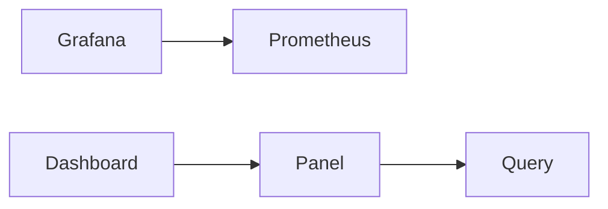

# Grafana — Turn those metrics into dashboards and alerts

| | |
|---|---|
| Levels | Beginner → Intermediate → Production |
| Time | Beginner ~25 min · full module ~3h |
| Prerequisites | [Prometheus](../06-prometheus/README.md) first success (same ideas; this compose starts its own Prometheus) |
| You will be able to | (1) explain data source vs dashboard vs panel (2) add Prometheus as a data source and draw `up` (3) say why dashboards should be in git |

**Last verified:** 2026-08-16 · **Tested with:** Grafana 11.x in Docker

## 60-second overview

Grafana queries Prometheus (and other backends) and draws the result. It is not the metrics database. A [data source](../docs/GLOSSARY.md) is the backend; a [dashboard](../docs/GLOSSARY.md) is a page of **panels**; each panel runs a query. Those files belong in git so the next laptop matches this one.

## Mental model

Grafana is a window. It does not store your metrics (usually). It asks Prometheus questions and draws the answers.



## Skip to

| Band | What you get | Go |
|---|---|---|
| Beginner | Concepts + Explore `up` | [below](#beginner-core-concepts) |
| Intermediate | Variables, alerting choice, dashboards in git | [below](#intermediate-go-deeper) |
| Production | Auth, RBAC, Helm, performance | [below](#production) |

## Beginner: core concepts

### Data source

- **What it is:** A connection Grafana uses to run queries — here Prometheus at `http://prometheus:9090`. See [glossary](../docs/GLOSSARY.md).
- **Why it exists:** One Grafana can talk to many backends. The window is not the database.
- **How it looks:** [examples/docker/provisioning/datasources/prometheus.yml](./examples/docker/provisioning/datasources/prometheus.yml) is loaded at startup. You should not have to click “Add data source” for first success.
- **Common confusion:** From *inside* the Grafana container, `localhost:9090` is Grafana itself, not Prometheus. Use the compose **service name**. `localhost` is correct only when Grafana and Prometheus run on your host, not in two containers.

### Dashboard and panel

- **What it is:** A dashboard is a saved page. A panel is one chart, stat, or table on that page.
- **Why it exists:** Explore is for a question. A dashboard is the question you will ask again tomorrow.
- **How it looks:** One timeseries panel whose query is `up` — [examples/docker/provisioning/dashboards/json/up.json](./examples/docker/provisioning/dashboards/json/up.json).
- **Common confusion:** A dashboard is not a data source. Deleting a dashboard does not delete Prometheus data. Copy-pasting a screenshot is not a dashboard you can review in git.

### Query in the panel (PromQL)

- **What it is:** The same [PromQL](../docs/GLOSSARY.md) you typed in Prometheus, now stored on the panel.
- **Why it exists:** Grafana does not invent a second metrics language for Prometheus.
- **How it looks:** Panel → Query → `up` or `rate(prometheus_http_requests_total[5m])`.
- **Common confusion:** If the panel is empty, check the data source picker on the panel (must be Prometheus) before rewriting the query.

### Time picker

- **What it is:** The range in the top right (`Last 15 minutes`, `Last 6 hours`, …) plus auto-refresh.
- **Why it exists:** PromQL `rate(...[5m])` is “over 5 minutes of samples,” but *which* 5 minutes is the dashboard range.
- **How it looks:** `now-15m` → `now` on the provisioned dashboard.
- **Common confusion:** A 30-day range with 20 heavy panels will be slow. Shorten the range before blaming Prometheus.

### Folders and permissions (light)

- **What it is:** Dashboards live in folders. Users and teams get view/edit rights on a folder, not on “the whole Grafana” if you can help it.
- **Why it exists:** The on-call folder is not the same as a sandbox. [RBAC](../docs/GLOSSARY.md) belongs in Production; the idea starts here.
- **How it looks:** The provisioned dashboard lands in folder **Lessons**.
- **Common confusion:** Editor on a folder can change queries. That can page people. Viewer is the default you want for most humans.

## Beginner: first success

**Goal:** Open Grafana, confirm Prometheus as a data source, and see `up = 1` in Explore.  
**Time:** ~15 minutes

This stack includes Prometheus **and** Grafana. If the [Prometheus](../06-prometheus/README.md) compose is still bound to port 9090, stop it first (`cd ../06-prometheus/examples/docker && docker compose down`). Then, from this module directory:

```bash
cd examples/docker
docker compose up -d
```

1. Open [http://localhost:3000](http://localhost:3000).
2. Log in as `admin` / `admin`. Grafana will ask you to change the password. Change it. Do not leave `admin` on a machine that is not yours; never use `prom-operator` here (that password belongs to the Helm chart in Production).
3. **Connections → Data sources**. **Prometheus** should already be there (provisioned). Click it → **Save & test**. You want “successfully queried.”
4. **Explore** (compass). Choose Prometheus. Metric `up` → **Run query**.
5. Optional: **Add to dashboard** → Save, so you have a dashboard you clicked yourself.

**Expected output:** Explore shows `up` at **1** (one series, `job="prometheus"`). Save & test on the data source succeeds.

The compose also loads a minimal dashboard **up** under **Dashboards → Lessons**. First success is Explore; the file is there so you can see “dashboard as code” without clicking.

**If it failed:**

| What you see | Fix |
|---|---|
| Port 3000 or 9090 already allocated | Stop the other stack (`docker compose down` in `06-prometheus/examples/docker` or here). |
| Data source test fails / no data | URL must be `http://prometheus:9090` from inside Compose, not `http://localhost:9090`. See the provisioned file. |
| Login loop or forgotten password | `docker compose down -v` removes `grafana-data` and resets to `admin` / `admin`. |
| Explore empty | Wait ~15s for Prometheus to scrape itself. Confirm http://localhost:9090/targets is UP. |
| Image pull error on `grafana/grafana:11.6.16` | Check Docker Hub tags; pin another 11.x and retry. |

## Intermediate: go deeper

### Variables (`namespace`, `job`)

A variable is a dropdown that is substituted into every panel query. Typical ones: `job`, `namespace`, `instance`.

```promql
label_values(up, job)
```

That query fills `$job`. Panels then use `up{job="$job"}`. One dashboard serves every job instead of a copy per team. Create one under **Dashboard settings → Variables**.

### Library panels

A library panel is a panel definition stored once and reused on many dashboards. Change the library copy; the dashboards that include it pick up the change. Use it when the same “request rate” panel would otherwise be pasted six times. This module does not ship one.

### Grafana alerting vs Prometheus Alertmanager

| Use Prometheus Alertmanager when… | Use Grafana alerting when… |
|---|---|
| Rules already live next to the TSDB (`PrometheusRule`, `rule_files`) | You want one alert UI across Prometheus, Loki, and other data sources |
| You need inhibit / silence / route in Alertmanager | Dashboards and alerts are owned by the same Grafana folder |
| The cluster already runs `kube-prometheus-stack` | A team lives in Grafana and does not want to edit Prometheus YAML |

Do not evaluate the same SLO in both places. You will get two pages. Alertmanager config used in the Prometheus module: [../06-prometheus/examples/alertmanager-config.yaml](../06-prometheus/examples/alertmanager-config.yaml).

### Dashboard as code

A dashboard that exists only in a browser will drift. Put it in git.

| Mechanism | What it is |
|---|---|
| Provisioning (this lab) | Files under `provisioning/` mounted into Grafana. Datasource: [prometheus.yml](./examples/docker/provisioning/datasources/prometheus.yml). Dashboard: [up.json](./examples/docker/provisioning/dashboards/json/up.json) via [provider.yml](./examples/docker/provisioning/dashboards/provider.yml). |
| Terraform | `grafana_dashboard` / `grafana_data_source` resources against the Grafana API. Same idea, different syntax. |
| Git sync | Grafana (or Grafana Cloud) pulls a repo on a timer. |

The JSON in this repo is a complete, loadable dashboard that graphs `up`. It is not the incomplete snippet the old module showed. Export from the UI (**Share → Export**) when you want to capture a dashboard you clicked together.

## Production

**You should already be able to:** open Grafana, run `up` in Explore, and explain that a data source is not a dashboard.

### Auth — do not expose `:3000` to the internet

`admin` / `admin` is a laptop default. On a network, put Grafana behind SSO (OAuth, LDAP, or your company’s OIDC) and TLS. Do not publish port 3000 on a public IP. A reverse proxy plus authentication is the minimum; anonymous Viewer is a demo setting, not a plan.

### RBAC, teams, folders

Map teams to folders. On-call gets Viewer (or Alerting viewer) on the production folder. Editors belong on a sandbox folder. Grafana’s roles are org-wide unless you use teams + folder permissions; do not make everyone Admin so “it works.”

### Secrets do not belong in dashboard JSON

Dashboard JSON is git. A Slack webhook, a token, or a password in a panel or annotation will leak. Datasource credentials live in provisioning with env-var substitution, or in the Grafana database set by an operator — not in `up.json`. Alertmanager webhooks stay in Alertmanager (or a secret the chart mounts).

### kube-prometheus-stack Grafana

The cluster install lives in [Prometheus Production](../06-prometheus/README.md#production). The same Helm chart starts Grafana. Typical access:

```bash
kubectl -n monitoring port-forward svc/prometheus-grafana 3000:80
```

Default user is `admin`. The chart password is often `prom-operator` (or a random value in the `prometheus-grafana` secret). Change it. Enable SSO in chart values; do not leave that password on a shared cluster.

### Performance

- Prefer [recording rules](../docs/GLOSSARY.md) in Prometheus for panels that run every 10s.
- Fewer panels, shorter time ranges, no `.*` regex across all series.
- Repeat variables (`job`, `namespace`) so a dashboard cannot query the whole cluster by accident.

## Pitfalls

| Symptom | Likely cause | Fix |
|---|---|---|
| Panel empty / “no data” | Datasource URL is `localhost:9090` from inside the container | Use `http://prometheus:9090` on the Compose network |
| Permission denied / dashboard missing | User is Viewer on that folder, or the dashboard is in another org | Check the folder and the user’s role |
| Slow dashboard | Long range, many panels, expensive PromQL | Shorten time, drop panels, record the query |
| Save & test fails | Prometheus not up yet, or port conflict | `docker compose ps` and http://localhost:9090/targets |
| Two pages for one outage | Grafana alert **and** Prometheus alert on the same series | Pick one path |

## How this connects

- **Previous:** [Prometheus](../06-prometheus/README.md) — required. Grafana with no data source is an empty window.
- **Next:** [Capstone projects](../projects/README.md) when you want the same path on an app. Logs (Loki) and traces (Tempo) are other data sources in this same window — same Explore, different backend. This module does not install them.
- **When not to use this:** A single PromQL in the Prometheus UI does not need Grafana. Do not install Grafana to “add monitoring” if nothing exposes `/metrics` yet.

## Practice

### Basic

1. **Setup:** Docker running; `06-prometheus` compose stopped.  
   **Task:** `docker compose up -d` in `examples/docker`. Log in, Save & test Prometheus, Explore `up`.  
   **Hint:** Change the admin password when asked.  
   **Success:** Explore shows `up = 1`.

2. **Setup:** Explore showing `up`.  
   **Task:** Add to dashboard and save as `lab-up`.  
   **Hint:** Top right of Explore → Add to dashboard.  
   **Success:** **Dashboards** lists `lab-up` and the panel is `1`.

### Intermediate

3. **Setup:** A saved dashboard (yours or **Lessons / up**).  
   **Task:** Add a query variable `job` from `label_values(up, job)` and change the panel to `up{job="$job"}`.  
   **Hint:** Dashboard settings (gear) → Variables → Query type.  
   **Success:** The dropdown lists `prometheus`; switching it still shows a line.

### Production

4. **Setup:** The provisioned files in [examples/docker/provisioning](./examples/docker/provisioning/).  
   **Task:** A teammate wants to paste a Slack webhook into dashboard JSON and publish `:3000` on the office Wi-Fi. Write where the webhook lives instead, which file adds a data source in git, and what you put in front of Grafana before it leaves localhost.  
   **Hint:** JSON is copied; secrets are not.  
   **Success:** Webhook stays out of dashboard JSON (Alertmanager / secret / env). Datasource file is `provisioning/datasources/prometheus.yml`. You name SSO or at least auth + TLS, not a naked `:3000`.

<details>
<summary>Solution notes</summary>

1. `cd examples/docker && docker compose up -d` → http://localhost:3000 → `admin`/`admin` → Connections → Prometheus → Save & test → Explore → `up`.  
2. Explore → Add to dashboard → Save.  
3. Variables → name `job`, query `label_values(up, job)`. Panel query `up{job="$job"}`.  
4. Webhook: Alertmanager or a secret, never `up.json`. Data source: [provisioning/datasources/prometheus.yml](./examples/docker/provisioning/datasources/prometheus.yml). Exposure: SSO/OAuth/LDAP plus TLS; do not bind 3000 to the world.

</details>

## Cheat sheet

One-page commands and objects: [cheatsheet.md](./cheatsheet.md).

## Official documentation

- [Start here — Build your first dashboard](https://grafana.com/docs/grafana/latest/getting-started/build-first-dashboard/) — click path after a data source exists
- [Start here — Prometheus data source](https://grafana.com/docs/grafana/latest/datasources/prometheus/) — URL, auth, query editor
- [Deep reference — provisioning](https://grafana.com/docs/grafana/latest/administration/provisioning/) — the files this lab mounts
- [Deep reference — alerting](https://grafana.com/docs/grafana/latest/alerting/) — Grafana unified alerting
- [Deep reference — dashboard best practices](https://grafana.com/docs/grafana/latest/visualizations/dashboards/build-dashboards/best-practices/) — variables, less clutter
