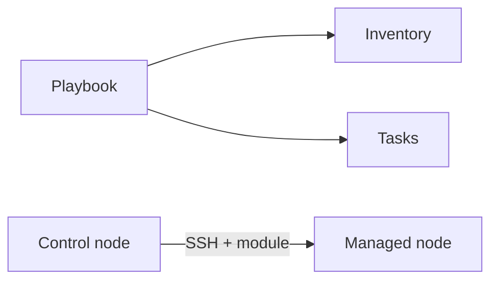

# Ansible — Describe server setup as repeatable recipes

| | |
|---|---|
| Levels | Beginner → Intermediate → Production |
| Time | Beginner ~30 min · full module ~4h |
| Prerequisites | [Linux](../01-linux/README.md) first success; SSH mental model; Python 3 on targets |
| You will be able to | (1) explain inventory vs playbook vs module (2) run a playbook against localhost (3) say why a task should be idempotent |

**Last verified:** 2026-08-16 · **Tested with:** Ansible 2.16+ / 2.17+

## 60-second overview

Ansible is a recipe you run from one machine that reaches others over SSH. You list the hosts, write the tasks in YAML, and Ansible uses [modules](../docs/GLOSSARY.md) so a second run does nothing if the box already matches. There is no agent on the target — only Python and SSH.

## Mental model

Ansible is SSH plus a recipe book. [Inventory](../docs/GLOSSARY.md) is the guest list; the [playbook](../docs/GLOSSARY.md) is the menu; a module is one cooking technique that can be repeated safely.



## Skip to

| Band | What you get | Go |
|---|---|---|
| Beginner | Concepts + first success on localhost | [below](#beginner-core-concepts) |
| Intermediate | Handlers, templates, check mode, tags | [below](#intermediate-go-deeper) |
| Production | Roles, Vault, collections | [below](#production) |

## Beginner: core concepts

### Control node vs managed node

- **What it is:** The [control node](../docs/GLOSSARY.md) is where you run `ansible-playbook`. A [managed node](../docs/GLOSSARY.md) is a host it configures.
- **Why it exists:** One laptop or CI runner can configure many servers. The model is [agentless](../docs/GLOSSARY.md): nothing extra is installed and left running on the target.
- **How it looks:** You SSH in as yourself today. Tomorrow the same SSH user is the one Ansible uses.
- **Common confusion:** The control node is not a special Ansible server. It is just the machine with the `ansible` package. Localhost can be both control and managed (that is first success).

### Inventory

- **What it is:** The list of hosts and groups a playbook may touch. Ours is [examples/inventory.ini](./examples/inventory.ini).
- **Why it exists:** The same recipe should run against “web” in staging and in prod without rewriting tasks.
- **How it looks:** An `ini` or YAML file, or later a script that prints JSON (dynamic inventory).
- **Common confusion:** Inventory is not the playbook. The playbook is the recipe; inventory is *who* it cooks for.

### Modules vs `shell` / `command`

- **What it is:** A module is one discrete action (`copy`, `apt`, `service`). `command` and `shell` just run a string.
- **Why it exists:** Modules know the desired end state and report `changed` only when they had to act.
- **How it looks:** `ansible.builtin.copy:` with `dest` and `content`, not `echo x > /tmp/file`.
- **Common confusion:** `shell` is not “more powerful, so always use it.” It is the escape hatch. It is usually not [idempotent](../docs/GLOSSARY.md).

### Playbook

- **What it is:** A YAML file of *plays*. A play names `hosts` and a list of `tasks`.
- **Why it exists:** You want the order of work written down, reviewable, and re-runnable.
- **How it looks:** [examples/hello.yml](./examples/hello.yml) — one play, three tasks, `hosts: local`.
- **Common confusion:** A playbook is not a bash script in YAML. Each task should describe a state (“file exists with this content”), not a step you hope is safe to repeat.

### Idempotency

- **What it is:** Running the same playbook twice leaves the system in the same state. The second run reports `changed=0`.
- **Why it exists:** You will re-run playbooks from CI and after failures. A task that always appends or always restarts is a bug.
- **How it looks:** First run of `hello.yml` → `changed=1`. Second run → `changed=0`. That is the lesson.
- **Common confusion:** “The command succeeded” is not idempotent. `echo x >> file` succeeds forever and grows the file.

## Beginner: first success

No second VM. Localhost is the managed node.

**Goal:** Write a file with Ansible, then prove a second run changes nothing.  
**Time:** ~15 minutes

Install on the control node (Ubuntu/Debian):

```bash
sudo apt update && sudo apt install -y ansible
ansible --version
```

Then:

```bash
cd examples
ansible-playbook -i inventory.ini hello.yml
ansible-playbook -i inventory.ini hello.yml   # second run: changed=0
```

**Expected output:** First recap has `changed=1` (or more) and the debug task prints `Ansible was here`. Second recap has `changed=0`. A Python interpreter warning is harmless.

```text
TASK [Write a file] ************************************************************
changed: [localhost]

TASK [Show] ********************************************************************
ok: [localhost] => {
    "out.stdout": "Ansible was here"
}

PLAY RECAP *********************************************************************
localhost                  : ok=3    changed=1    unreachable=0    failed=0
```

Second run, same play, `Write a file` is `ok` not `changed`, and recap is `changed=0`.

**If it failed:** `ansible-playbook: command not found` → install is missing from `PATH`. `ERROR! couldn't resolve module` → your Ansible is older than 2.10 and does not understand FQCNs; upgrade, or this module’s 2.16+ line does not match your package. Permission errors on `/tmp` are unusual; pick another `dest` under your home directory.

## Intermediate: go deeper

You should already have run [examples/hello.yml](./examples/hello.yml) twice.

### Handlers and a real service

[examples/nginx.yml](./examples/nginx.yml) installs nginx with `apt`, deploys [examples/templates/index.html.j2](./examples/templates/index.html.j2), and starts the service. A [handler](../docs/GLOSSARY.md) restarts nginx only when the template task reports `changed`.

This playbook needs `become: true` (sudo) and a Debian/Ubuntu box. It is not first success.

```bash
cd examples
ansible-playbook -i inventory.ini nginx.yml
ansible-playbook -i inventory.ini nginx.yml   # handler should not fire
```

`notify: Restart nginx` must match the handler `name:` exactly.

### Templates and group vars

`template` renders Jinja2 (`{{ inventory_hostname }}`) onto the target. Use it for config files you would otherwise hand-edit.

Variables shared by every host in an inventory group belong in `group_vars/<group>.yml` next to the inventory (`group_vars/local.yml` for the `[local]` group). This repo does not ship a `group_vars/` tree; add one when two hosts should share values.

### `--check`, `--diff`, and tags

```bash
cd examples
ansible-playbook -i inventory.ini nginx.yml --check --diff
ansible-playbook -i inventory.ini nginx.yml --tags page --check --diff
```

`--check` is a dry run. `--diff` prints file changes. The template task is tagged `page` so you can run just that piece. Check mode cannot prove a handler or a freshly installed service; treat it as a review aid, not a test suite.

### One-off SSH vs playbook vs role

| | One-off SSH | Playbook | Role |
|---|---|---|---|
| You type | `ssh host 'apt install nginx'` | YAML of tasks + inventory | A directory you reuse across playbooks |
| Repeat safely | You hope | Yes, if tasks are idempotent | Same, plus sharing |
| When | One box, one time | A known set of hosts | The same baseline on many playbooks |

A [role](../docs/GLOSSARY.md) is not a more magical playbook. It is a layout so you stop copy-pasting task lists. See [Production](#production).

## Production

**You should already be able to:** run [hello.yml](./examples/hello.yml) twice and explain `changed=0`; say what inventory is versus a playbook.

### Roles

A role is a directory Ansible knows how to load. The only role file in this module is [examples/roles/common/tasks/main.yml](./examples/roles/common/tasks/main.yml). The usual layout, when you outgrow one task file:

```text
roles/common/
  tasks/main.yml       # present here
  handlers/main.yml    # add when you have handlers
  templates/           # add when you have templates
  defaults/main.yml    # weakest variables
  vars/main.yml        # stronger role variables
```

Call it from a play with `roles: [common]` and `--roles-path roles` (or put `roles/` next to the playbook). Do not paste the same ten tasks into every playbook.

### Vault (the encrypt command, not a server)

`ansible-vault encrypt_string` turns a secret into ciphertext you paste into a playbook or `group_vars` file. The vault *password* is a prompt or a file your CI injects. It is not HashiCorp [Vault](../docs/GLOSSARY.md).

```bash
ansible-vault encrypt_string 'change-me' --name 'db_password'
```

Commit the ciphertext. Do not commit the vault password. Anyone who can decrypt can read every string you encrypted with that password.

### Collections and FQCN

Write `ansible.builtin.copy`, not `copy`. That fully qualified collection name (FQCN) names the [collection](../docs/GLOSSARY.md) the module comes from (`ansible.builtin`, `community.docker`, …). Install extra collections with `ansible-galaxy collection install`. This guide’s playbooks already use FQCNs.

### Dynamic inventory (later)

A plugin or script can print hosts as JSON so you do not hand-edit `inventory.ini` when VMs come from a cloud API. AWS inventory is the usual next lab. It needs cloud credentials and is **not** required here.

### Why not `command` / `shell`

Modules report `changed` correctly and fail in a structured way. `command` and `shell` report `changed` on every run unless you add `changed_when`, and they hide “the pipeline returned 0 but did nothing useful.” Use them only when no module exists, and then set `changed_when` and `failed_when`. First success uses `command` only to `cat` a file, with `changed_when: false`, so it does not spoil the recap.

## Pitfalls

| Symptom | Likely cause | Fix |
|---|---|---|
| `UNREACHABLE` / SSH errors | Wrong user, key, or host key prompt | `ansible -i inventory.ini local -m ping`; set `ansible_user` / `ansible_ssh_private_key_file`; for localhost keep `ansible_connection=local` |
| `couldn't resolve module` / module not found | Typo, missing collection, or old Ansible | Use FQCN; `ansible-galaxy collection install …`; upgrade to 2.16+ |
| Missing sudo password / `privilege escalation` | `become: true` without a password or NOPASSWD | `ansible-playbook --ask-become-pass`, or configure sudo. [hello.yml](./examples/hello.yml) does not need become |
| Variable “won’t change” | You set it in the wrong layer | `-e` / `--extra-vars` wins; role defaults are weak. One paragraph below |
| `changed=1` on every run | `shell`/`command` without `changed_when`, or `apt` with `update_cache: true` and no `cache_valid_time` | Prefer a module; copy the `changed_when: false` pattern from [hello.yml](./examples/hello.yml) |

Variable precedence is a list, not a merge you can guess. `--extra-vars` wins. Role defaults lose to almost everything. Play `vars:` beat inventory `group_vars`. If a value will not stick, you are setting it in a weaker layer than you think. Official order: [Using variables](https://docs.ansible.com/ansible/latest/playbook_guide/playbooks_variables.html#understanding-variable-precedence).

## How this connects

- **Previous:** [Linux](../01-linux/README.md) — packages, files, services, and SSH are what playbooks change. [Git](../02-git/README.md) — the playbook belongs in a repo.
- **Next:** [Terraform](../09-terraform/README.md) — Terraform creates the box; Ansible configures it. [Docker](../03-docker/README.md) — the `community.docker` collection can build and run containers the same way `apt` installs packages.
- **When not to use this:** Do not use Ansible to provision cloud APIs if Terraform is the team’s IaC. Do not use it as a poor Kubernetes controller; use kubectl, Helm, or GitOps for cluster objects.

## Practice

### Basic

1. **Setup:** First success done; [examples/hello.yml](./examples/hello.yml) still points at `/tmp`.  
   **Task:** Change the `content:` of the copy task and run the playbook twice.  
   **Hint:** The first re-run after the edit should show `changed=1` on `Write a file`; the second should show `changed=0`.  
   **Success:** Recap on the last run is `changed=0`, and `cat /tmp/ansible-first-success.txt` shows your new text.

2. **Setup:** [examples/inventory.ini](./examples/inventory.ini) and [examples/hello.yml](./examples/hello.yml).  
   **Task:** Add a fourth task that prints `inventory_hostname` with `ansible.builtin.debug`.  
   **Hint:** `msg: "{{ inventory_hostname }}"` or `var: inventory_hostname`.  
   **Success:** The play output includes `localhost`.

### Intermediate

3. **Setup:** Debian/Ubuntu with sudo; [examples/nginx.yml](./examples/nginx.yml).  
   **Task:** Run only the tagged `page` task in check mode with diffs. Then change one word in [examples/templates/index.html.j2](./examples/templates/index.html.j2) and run check+diff again.  
   **Hint:** `ansible-playbook -i inventory.ini nginx.yml --tags page --check --diff`.  
   **Success:** The second check run prints a unified diff of the HTML. You have not been asked to install nginx if check mode already shows the template change.

### Production

4. **Setup:** `ansible-vault` on your PATH (same package as Ansible).  
   **Task:** Encrypt a dummy string named `app_secret`. Do not write a vault password into the repo.  
   **Hint:** `ansible-vault encrypt_string 'demo' --name 'app_secret'`.  
   **Success:** You have a `!vault |` block you could paste under `vars:`, and you can say who must know the vault password.

<details>
<summary>Solution sketches</summary>

1. Edit `content:` in [examples/hello.yml](./examples/hello.yml); run twice; `changed` drops to 0.
2. Add `- name: Hostname` / `ansible.builtin.debug:` / `var: inventory_hostname`.
3. `--tags page --check --diff` after a template edit shows `-` / `+` lines.
4. `encrypt_string` prints ciphertext; store the password in a file your CI mounts, not in git.

</details>

## Cheat sheet

One-page commands: [cheatsheet.md](./cheatsheet.md).

## Official documentation

- [Start here: Getting started](https://docs.ansible.com/ansible/latest/getting_started/index.html) — inventory, ad-hoc, first playbook.
- [Deep reference: Playbook guide](https://docs.ansible.com/ansible/latest/playbook_guide/index.html) — variables, handlers, roles, vault.
- [Module index](https://docs.ansible.com/ansible/latest/collections/index_module.html) — look up a module before reaching for `shell`.
