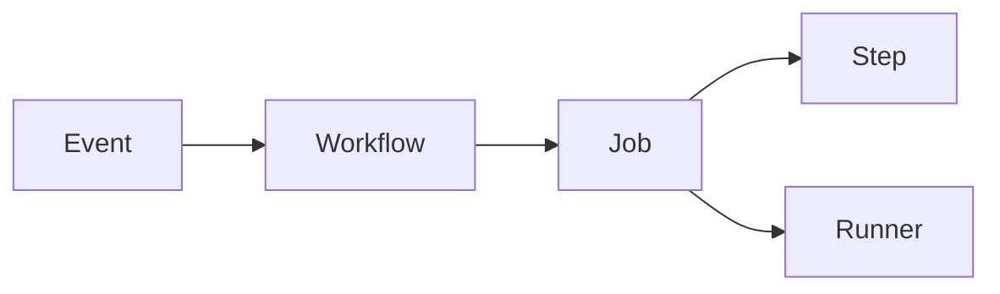

# GitHub Actions — Run build, test, and deploy steps on a git event

| | |
|---|---|
| Levels | Beginner → Intermediate → Production |
| Time | Beginner ~25 min · full module ~3h |
| Prerequisites | Git + a GitHub repo you can push to; [Docker](../03-docker/README.md) helps for later examples |
| You will be able to | (1) explain [workflow](../docs/GLOSSARY.md) vs [job](../docs/GLOSSARY.md) vs step vs [runner](../docs/GLOSSARY.md) (2) add a workflow that runs on push and see the green check (3) say why secrets do not belong in YAML |

**Last verified:** 2026-08-16 · **Tested with:** GitHub Actions (`actions/checkout@v4`, `actions/setup-node@v4`)

There is nothing to install. The workflow runs on GitHub.com after you push. A file that only lives in this learning repo does not run.

## 60-second overview

GitHub Actions is CI/CD that lives in the repository. You commit a YAML file under `.github/workflows/`. On a git event (push, pull request, a schedule) GitHub starts a disposable machine, checks out your code, and runs the steps you listed. The result is a red or green mark on the commit.

Use it to test, build an image, and deploy. Do not use it as a general-purpose computer that stays on.

Jargon: [glossary](../docs/GLOSSARY.md). How to study: [How to learn](../docs/HOW_TO_LEARN.md).

## Mental model

A **workflow** is a recipe that GitHub cooks in a disposable kitchen (the **runner**) whenever something happens to the repo (push, PR, cron).



The event starts the workflow. Each job gets its own runner. Steps in a job run in order and share that runner’s disk. Two jobs do not share a disk unless you pass an [artifact](../docs/GLOSSARY.md).

## Skip to

| Band | What you get | Go |
|---|---|---|
| Beginner | Concepts + first success (copy, push, green check) | [below](#beginner-core-concepts) |
| Intermediate | Cache, artifacts, matrix, Docker-to-GHCR | [below](#intermediate-go-deeper) |
| Production | Token permissions, secrets, OIDC, reusable workflows | [below](#production) |

## Beginner: core concepts

### Workflow file location

- **What it is:** A YAML file under `.github/workflows/` that GitHub reads. Any `*.yml` / `*.yaml` in that folder is a workflow.
- **Why it exists:** The recipe lives next to the code it builds. Reviewers see it in the same PR.
- **How it looks:** `.github/workflows/first-success.yml`. The copy in this repo is [examples/ci.yml](./examples/ci.yml).
- **Common confusion:** `examples/ci.yml` here does not run. Copy it into *your* GitHub.com repo at the path above.

### Triggers (`on`)

- **What it is:** The events that start the workflow: `push`, `pull_request`, `schedule`, `workflow_dispatch` (a button in the UI).
- **Why it exists:** Tests on every PR, a deploy only on `main`, a nightly job if you want one.
- **How it looks:** `on: [push, pull_request]`
- **Common confusion:** `on.push.branches: [main]` means pushes to a feature branch do nothing. That is the usual reason a new workflow “never runs.”

### Jobs and steps

- **What it is:** A [job](../docs/GLOSSARY.md) is a list of steps on one runner. A workflow has one or more jobs. A step is either `uses:` (an action) or `run:` (a shell snippet).
- **Why it exists:** Steps share a workspace. Separate jobs can run in parallel, or one can `need:` another.
- **How it looks:** `jobs.hello.steps` in [examples/ci.yml](./examples/ci.yml).
- **Common confusion:** Job B cannot see files job A wrote unless A uploaded an artifact and B downloaded it.

### Runners

- **What it is:** The machine that executes the job. **GitHub-hosted** (`ubuntu-latest`) is a fresh VM GitHub throws away. **Self-hosted** is a machine you run.
- **Why it exists:** Something has to execute `npm test`. Beginner uses GitHub-hosted.
- **How it looks:** `runs-on: ubuntu-latest`
- **Common confusion:** That VM is not your laptop. `localhost` in a step is the runner, not your machine. Secrets you only have locally are not there.

### Actions (`uses:`) vs `run:`

- **What it is:** `uses:` runs a packaged action from a repo (often `actions/checkout`). `run:` is bash on the runner (or `pwsh` / `cmd` if you set `shell:`).
- **Why it exists:** Checking out the repo and installing Node are boring to reimplement.
- **How it looks:** `uses: actions/checkout@v4` then `run: echo "ok"`
- **Common confusion:** `uses: some/action@main` can change under you. Pin a version tag (`@v4`). Pinning a commit SHA is stricter; see Production.

## Beginner: first success

**Goal:** Push a workflow to *your* GitHub repo and see a green run whose log contains `ok`.  
**Time:** ~15 minutes if you already have a repo.

1. Create or open a repository on GitHub.com (public or private; Actions must be allowed).
2. Copy [examples/ci.yml](./examples/ci.yml) to `.github/workflows/first-success.yml` in that repo.
3. Commit and push.
4. Open the repo in the browser → **Actions** tab → the “First success” run.

```yaml
name: First success
on: [push, pull_request]
jobs:
  hello:
    runs-on: ubuntu-latest
    steps:
      - uses: actions/checkout@v4
      - name: Prove it ran
        run: |
          echo "ok"
          uname -a
```

**Expected output:** a green check on the commit. The “Prove it ran” step log contains a line `ok` and a `uname` line (Linux kernel string from the runner). Exact kernel text will differ.

**If it failed:**

- Actions tab is empty or says disabled → repo **Settings → Actions → General** → allow Actions.
- Workflow file is ignored → it is not under `.github/workflows/`, or the extension is wrong.
- YAML error at parse time → indentation. Spaces, not tabs. Copy the file, do not retype from memory.
- You only saved the file locally → GitHub never saw it. Push to GitHub.com.

## Intermediate: go deeper

Worked files: [examples/node-ci.yml](./examples/node-ci.yml), [examples/docker-publish.yml](./examples/docker-publish.yml).

### Cache

Re-downloading `node_modules` every run wastes minutes. `actions/setup-node@v4` can cache from the lockfile:

```yaml
- uses: actions/setup-node@v4
  with:
    node-version: "20"
    cache: npm
```

`cache: npm` requires `package-lock.json` (or you switch to `cache: yarn` / `pnpm` and that tool’s lockfile). There is no magic cache of “whatever I installed last time” without a lockfile key.

### Artifacts

An [artifact](../docs/GLOSSARY.md) is a file a job stored for download or for a later job (a binary, a test report). Cache is for dependencies you will throw away; artifacts are for outputs you want to keep for a while.

[examples/node-ci.yml](./examples/node-ci.yml) uploads `npm-debug.log` if it exists (`if-no-files-found: ignore` so a clean test run is still green).

### Matrix

A matrix runs the same job with different inputs. [examples/node-ci.yml](./examples/node-ci.yml) tests Node 20 and 22. Failures in one cell do not skip the other unless you set `fail-fast` that way.

Copy that file into a **Node** repo that has `package-lock.json` and a `"test"` script. In this learning repo it will not pass — there is no `package.json` here.

### Build and push a Docker image (GHCR)

[examples/docker-publish.yml](./examples/docker-publish.yml) checks out, logs in to `ghcr.io` with `GITHUB_TOKEN`, and pushes `ghcr.io/<owner>/<repo>:<git-sha>`.

Read it before you copy it:

- `permissions.packages: write` is required. Default token permissions are often read-only.
- The image name must be lowercase. If the GitHub repo has capitals, the push fails until you lowercase the tag.
- There is no `:latest` tag. Pin what you deploy.
- The repo you copy this into must have a `Dockerfile` at the context path (`.` here).

### Environments

An *environment* (`staging`, `production`) is a named bucket of secrets and protection rules (required reviewers, wait timer). You set `environment: production` on a job. Mention them now so the Production section is not a surprise. You do not need one for first success.

### Local script vs Actions vs your laptop

| Reach for… | When |
|---|---|
| A script on your laptop | A 10-second test you run while editing. No runner, no YAML. |
| A script in the repo (`make test`) | The same commands locally and in CI. Actions should call this, not duplicate it. |
| GitHub Actions | Those commands must run on every push/PR, on a clean machine, and leave a record on the commit. |

Actions is not a replacement for knowing how to run the test yourself.

## Production

**You should already be able to:** see one green workflow; name workflow, job, step, and runner; know that `examples/` in this repo does not execute.

### `GITHUB_TOKEN` permissions — least privilege

Every run gets a short-lived `GITHUB_TOKEN`. New repositories default that token toward read. A job that pushes a package or comments on a PR must ask for the verb:

```yaml
permissions:
  contents: read
  packages: write
```

Set this at workflow or job level. Do not turn on “Read and write permissions” globally in the repo settings to paper over a missing `permissions:` block.

### Secrets vs variables

**Secrets** (repo / environment / org) are encrypted at rest and masked in logs. **Variables** are non-secret config (`NODE_VERSION=20`). Neither belongs as a literal in YAML.

```yaml
env:
  API_URL: ${{ vars.API_URL }}
  TOKEN: ${{ secrets.DEPLOY_TOKEN }}
```

Never `echo` a secret. Masking is best-effort; a tool that prints env can leak it.

### OIDC to cloud (no long-lived keys)

[OIDC](../docs/GLOSSARY.md) lets the job prove “I am this workflow on this repo” to AWS, Azure, or GCP and receive a short-lived cloud credential. You configure a trust policy in the cloud, not an access key in GitHub Secrets.

This module does not include a working AWS role. The official write-up is [OpenID Connect](https://docs.github.com/en/actions/concepts/security/openid-connect). Copy a role ARN from your own account when you have one; do not paste a sample from a blog into production.

### Reusable workflows

A workflow can be called by another with `on: workflow_call`. Use that when three repos share the same test or deploy steps. Official page: [Reusing workflows](https://docs.github.com/en/actions/how-tos/reuse-automations/reuse-workflows). Callers pass inputs; they do not get the callee’s secrets unless you explicitly `secrets: inherit`.

### Environment protection rules

On a production environment you can require a reviewer, a wait timer, or a list of allowed branches. A `environment: production` job sits yellow until those rules pass. That is how you stop `main` from deploying because someone pushed a tag by mistake.

### Pin what you run

- Do not ship your own images as `:latest`. Tag with the git SHA (see [examples/docker-publish.yml](./examples/docker-publish.yml)).
- Pin third-party actions to a version tag (`@v4`). Pinning a commit SHA is stronger if you do not trust the tag. GitHub documents that in the security guide below.

## Pitfalls

| Symptom | Likely cause | Fix |
|---|---|---|
| Workflow never starts | File not under `.github/workflows/`, branch/path filters, or Actions disabled | Check the path, `on:` filters, and repo Settings → Actions. |
| Secret is empty | Secret lives on another environment, or this is a fork PR | Put the secret on the environment the job names. Fork PRs do not get the base repo’s secrets. |
| `Permission denied` pushing to GHCR | Missing `packages: write`, or the image name has capitals | Add the `permissions:` block. Lowercase `ghcr.io/owner/repo`. |
| Action cannot comment / open a PR | `GITHUB_TOKEN` has `contents: read` only | Grant the specific permission the step needs, not “write everything.” |
| `cache: npm` fails | No `package-lock.json` | Commit a lockfile, or drop `cache:`. |
| PR from a fork looks “broken” | `pull_request` from a fork cannot read your secrets and cannot write packages | Use `pull_request` for tests that need no secrets. Privileged deploy stays on `push` to your branches. |

## How this connects

- **Previous:** [Docker](../03-docker/README.md) and [Kubernetes](../04-kubernetes/README.md) — this is how you build the image, push it, and apply the Deployment.
- **Next:** [Prometheus](../06-prometheus/README.md) — you just shipped something; watch it. Capstone 1 ([full CI/CD pipeline](../projects/full-cicd-pipeline/README.md)) uses a workflow like these examples.
- **When not to use this:** A 10-second local test does not need CI yet. Do not use Actions as your production compute platform (long-running servers, extra-minute workloads that belong on a VM or Kubernetes).

## Practice

### Basic

1. **Setup:** A GitHub repo you can push to.  
   **Task:** Copy [examples/ci.yml](./examples/ci.yml) to `.github/workflows/first-success.yml`, push, open the Actions tab.  
   **Hint:** If the tab is empty, Actions may be disabled for the repo.  
   **Success:** A green run whose log contains `ok`.

2. **Setup:** The first-success workflow is green.  
   **Task:** Change the `echo` string, push again, confirm a new run.  
   **Hint:** Every push to a matching branch starts a new run. Old runs stay in the history.  
   **Success:** The new log shows your new string.

### Intermediate

3. **Setup:** A GitHub repo. Optional: an existing Node app with `package-lock.json`.  
   **Task:** Add [examples/node-ci.yml](./examples/node-ci.yml). If the repo is not a Node app, add a `package.json` with `"test": "echo ok"` and generate a lockfile (`npm install --package-lock-only` after a tiny `package.json`).  
   **Hint:** `cache: npm` needs the lockfile in the same commit as the workflow.  
   **Success:** Both matrix cells are green and `npm test` exits 0.

### Production

4. **Setup:** The first-success workflow is green.  
   **Task:** Add a workflow-level `permissions: { contents: read }` block (and nothing else). Confirm the workflow still runs. Write one sentence on why a deploy-to-cloud job would use OIDC instead of a long-lived access key stored as a secret.  
   **Hint:** Least privilege. OIDC is a short-lived identity the cloud can trust.  
   **Success:** Workflow still green; your sentence names “no long-lived key in GitHub Secrets.”

<details>
<summary>Solution sketches</summary>

1. Path must be exactly `.github/workflows/first-success.yml` in the repo GitHub hosts.
2. Edit the `run:` script, commit, push; open the newest run, not the first one.
3. Minimal `package.json`: `{ "name": "demo", "private": true, "scripts": { "test": "echo ok" } }` plus a lockfile.
4. Put `permissions:` next to `on:`. OIDC answer: the cloud issues a short-lived token after verifying the job’s identity, so a leaked GitHub secret is not a permanent cloud key.

</details>

## Cheat sheet

[cheatsheet.md](./cheatsheet.md) — file path, `on`, jobs/steps, permissions, secrets, cache, artifacts, matrix.

## Official documentation

- [Start here: Understand GitHub Actions](https://docs.github.com/en/actions/get-started/understand-github-actions) — workflow / job / step / runner
- [Start here: Workflows](https://docs.github.com/en/actions/concepts/workflows-and-actions/workflows) — where files go and what `on` means
- [Deep reference: Workflow syntax](https://docs.github.com/en/actions/reference/workflows-and-actions/workflow-syntax) — every key
- [Deep reference: Secure use](https://docs.github.com/en/actions/reference/security/secure-use) — tokens, secrets, third-party actions
- [OIDC](https://docs.github.com/en/actions/concepts/security/openid-connect) — cloud login without long-lived keys
- [Reusing workflows](https://docs.github.com/en/actions/how-tos/reuse-automations/reuse-workflows)
- [Publishing Docker images](https://docs.github.com/en/actions/tutorials/publish-packages/publish-docker-images) — GHCR pattern this module simplifies
