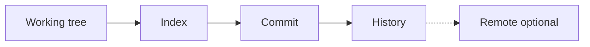

# Git — Record file history so you, a teammate, and CI share one source of truth

| | |
|---|---|
| Levels | Beginner → Intermediate → Production |
| Time | Beginner ~20 min · full module ~3h |
| Prerequisites | [Linux](../01-linux/README.md) first success; `git` on the PATH (`sudo apt install -y git` if missing) |
| You will be able to | (1) explain [working tree](../docs/GLOSSARY.md#working-tree) vs [index](../docs/GLOSSARY.md#index-git) vs [commit](../docs/GLOSSARY.md#commit) vs [remote](../docs/GLOSSARY.md#remote) (2) init, add, commit, and read `git log` (3) say why GitHub is a host, not Git, and why `git rm` does not delete a secret from history |

**Last verified:** 2026-09-04 · **Tested with:** git 2.43.0 (2.34+ on Ubuntu 22.04 is enough)

Work in `/tmp/git-lab`, not in this learning clone. The clone is already a git repo; lab commands belong in a throwaway directory.

## 60-second overview

Git stores snapshots of files in a hidden `.git` directory next to them. You change files, pick which ones belong in the next snapshot, and record a [commit](../docs/GLOSSARY.md#commit). Later you can see what changed, switch between lines of work, and copy history to another machine.

GitHub, GitLab, and similar sites are *hosts*: they speak Git over the network and add a website. They are not Git. First success never leaves your laptop.

Jargon: [glossary](../docs/GLOSSARY.md). How to study: [How to learn](../docs/HOW_TO_LEARN.md).

## Mental model

The working tree is the desk. The index is the inbox for the next snapshot. A commit is a labeled photo of the desk. A remote is a second album you sync when you choose to.



## Skip to

| Band | What you get | Go |
|---|---|---|
| Beginner | Concepts + first success (init, add, commit, log) | [below](#beginner-core-concepts) |
| Intermediate | Branches, merge vs rebase, ignore, a local remote | [below](#intermediate-go-deeper) |
| Production | Secrets in history, force-push, signed commits, host policy | [below](#production) |

## Beginner: core concepts

### Repository

- **What it is:** A directory that contains a `.git` folder. That folder *is* the repo: objects, refs, config. Everything next to `.git` is the working tree.
- **Why it exists:** History travels with the files. You do not need a server to record a snapshot.
- **How it looks:** `git init` creates `.git`. `ls -a` shows it. This learning guide is a repository because you cloned it; `/tmp/git-lab` will be one after first success.
- **Common confusion:** A GitHub page is not the repository. It is a copy (plus a UI) of some repository. Deleting the website does not delete a clone on your disk.

### Working tree, index, and commit

- **What it is:** Three places a file can be. The [working tree](../docs/GLOSSARY.md#working-tree) is the files you edit. The [index](../docs/GLOSSARY.md#index-git) (staging area) is the exact tree the *next* commit will store. A [commit](../docs/GLOSSARY.md#commit) is an immutable snapshot already in history.
- **Why it exists:** You often edit five files and want the next snapshot to contain two of them. The index is that selection.
- **How it looks:** `git status` prints three groups: staged, unstaged, untracked. `git add notes.txt` copies the file into the index. `git commit` writes a commit from the index, not from “whatever is dirty.”
- **Common confusion:** Saving the file in your editor is not `git add`. `git add` is not `git commit`.

### Commit

- **What it is:** A snapshot of the index, plus metadata: parent commit, author, date, message. Git *can* show a diff between two commits; it does not store “a patch” as the object.
- **Why it exists:** You need a point you can name, compare, and return to. CI later runs against a commit, not against “whatever was on someone’s laptop.”
- **How it looks:** `git log --oneline` — a hash and a message. `git show HEAD` — the snapshot plus the diff versus its parent.
- **Common confusion:** Amending or rebasing creates *new* commits. The old hashes still exist until nothing points at them and git garbage-collects. Changing a message does not rewrite a commit in place.

### Branch

- **What it is:** A [branch](../docs/GLOSSARY.md#branch) is a movable name pointing at a commit. [HEAD](../docs/GLOSSARY.md#head) is “the commit you are on,” usually the tip of a branch.
- **Why it exists:** Two lines of work (a fix and a feature) can fork from the same snapshot and join later.
- **How it looks:** `git branch` lists names; `*` is where you are. `git switch -c topic` creates `topic` and moves `HEAD` there.
- **Common confusion:** `main` (or `master` on older Git) is a default name, not a special object. Deleting a branch name does not delete commits that another name still reaches.

### Remote

- **What it is:** A [remote](../docs/GLOSSARY.md#remote) is another copy of the repository Git knows how to fetch from and push to. The URL can be a path on this disk or `https://` / `git@` on a host.
- **Why it exists:** Your laptop should not be the only copy. CI clones a remote. A teammate pushes to the same remote.
- **How it looks:** `git remote -v`. Empty after `git init`. [examples/local-remote.sh](./examples/local-remote.sh) adds `origin` pointing at a bare repo under `/tmp`.
- **Common confusion:** `origin` is the default *name* for a remote, not GitHub. If `git remote -v` prints nothing, you have no remote, even if you have a GitHub account.

### Clone versus init

- **What it is:** `git init` starts an empty repo in the current directory. `git clone URL` copies an existing repo (and usually sets `origin` to that URL). You cloned this guide; that did not require understanding remotes yet.
- **Why it exists:** Starting from nothing (`init`) and starting from someone else’s history (`clone`) are different jobs.
- **How it looks:** First success uses `init` in `/tmp/git-lab`. `git clone` of this repo is how you got the files; it is a download plus a remote named `origin`.
- **Common confusion:** Cloning this guide is not the Git first success. Do not run the lab commands in the guide clone.

## Beginner: first success

**Goal:** Create a local repo, record one commit, and read it back from `git log`.  
**Time:** ~15 minutes. No GitHub account.

If `git --version` fails:

```bash
sudo apt update && sudo apt install -y git
```

Then:

```bash
git --version
mkdir -p /tmp/git-lab && cd /tmp/git-lab
git init
git config user.email "learner@example.invalid"
git config user.name "Learner"
echo "hello" > README.md
git status
git add README.md
git commit -m "Add README"
git log --oneline
```

The two `git config` lines are **local** to this repo. They do not change your `--global` identity.

**Expected output:** `git init` prints `Initialized empty Git repository in /tmp/git-lab/.git/`. `git status` after the echo shows `README.md` under **Untracked files**, on branch `main` or `master`. After `git commit`, `git log --oneline` is one line: a short hash and `Add README`. Hashes differ. `git --version` on the machine that last verified this page was `git version 2.43.0`.

**If it failed:**

- `git: command not found` → the `apt install` line above.
- `Please tell me who you are` → you skipped the two `git config` lines. Run them in `/tmp/git-lab` (no `--global`) and commit again.
- `nothing to commit` after `echo` → the file was never `git add`ed, or you ran commit in a different directory. `pwd` should be `/tmp/git-lab`; `git status` should list `README.md`.

## Intermediate: go deeper

Worked files: [examples/gitignore-devops](./examples/gitignore-devops), [examples/local-remote.sh](./examples/local-remote.sh).

### Branch, then merge or rebase

```bash
cd /tmp/git-lab
git switch -c topic
echo "on topic" >> README.md
git add README.md
git commit -m "Note from topic"
git switch main          # or: git switch master
git merge topic
```

`merge` writes a join (a merge commit if both sides moved). If `main` did not move while you were on `topic`, Git fast-forwards: the name `main` slides to `topic`’s commit. That is still a merge. `rebase` replays your commits on top of the other branch and gives them new hashes.

| Reach for merge when… | Reach for rebase when… |
|---|---|
| The branch is shared, or you want the join visible in `git log --graph` | The branch exists only on your machine and you want a linear history before anyone else fetches it |

Do not rebase a branch other people already have. Their commits still point at the old hashes; your push then needs `--force` and their work looks “gone.”

### Ignore files

[examples/gitignore-devops](./examples/gitignore-devops) is a `.gitignore` for a DevOps tree: `.env`, Terraform state, `node_modules/`. Copy it to `.gitignore` in *your* repo (the filename in `examples/` is not `.gitignore`, so it does not hide files in this module).

`.gitignore` only affects untracked files. A file already committed stays in history until you stop tracking it (`git rm --cached FILE`) *and* you still have not removed the old commits. See Production.

### A remote that is just a directory

GitHub is one kind of remote. A bare repo on this disk is another. Run:

```bash
bash 09-git/examples/local-remote.sh
```

from the guide root (or pass the script’s path). It creates `/tmp/git-local-remote-lab/work` and `/tmp/git-local-remote-lab/origin.git`, commits once, and `git push`es to that path. **Expected output:** a line `SUCCESS: origin is /tmp/git-local-remote-lab/origin.git (a directory, not GitHub)`, then `git remote -v` showing that path twice (fetch and push), then one `git log` line. No network.

`git fetch` downloads objects. It does not change your working tree. `git pull` is fetch plus merge (unless you configured pull to rebase).

A GitHub account is useful later for [GitHub Actions](../08-github-actions/README.md). It is not required to finish this module.

## Production

**You should already be able to:** init, add, commit, and read `git log`; create a branch and say it is a pointer; explain that a remote is a URL or path, not “GitHub.”

### Secrets in history

If `PASSWORD=demo` was ever in a commit, deleting the file and committing again leaves the blob in the old snapshot. `git show HEAD~1:.env` still prints it. If that commit was pushed, anyone who fetched it has the secret.

Rotate the credential. History rewrite (`git filter-repo`, `git rebase -i`) is a cleanup of *your* refs, not a recall from every clone. Do not treat rewrite as secret deletion.

### Force-push is a shared-branch incident

`git push --force` moves the remote branch name to a commit you have, even if the remote had commits you do not. On a branch only you use, that can be intentional after a rebase. On `main` (or any branch teammates and CI track) it drops other people’s commits from that name. Prefer `--force-with-lease` if you must; prefer not to force-push shared branches at all.

### Signed commits

`git commit -S` attaches a cryptographic signature (SSH or GPG). The host may show “verified.” That proves the commit was signed by a key the host knows, not that the patch is correct. Skip the key setup until you need it; unsigned commits are enough for this lab.

### Host policy is not a Git object

Protected branches, required reviews, and “no force-push to main” are settings on GitHub/GitLab. Git on your laptop will still create any commit you ask for. The host refuses the *push*. That is why first success never needed a host, and why CI lives in [GitHub Actions](../08-github-actions/README.md), not here.

### SSH or HTTPS, not a token in the URL

To talk to a host: SSH (`git@github.com:owner/repo.git` plus a key) or HTTPS plus a credential helper. Do not embed a token in the remote URL — it lands in `.git/config` and in `git remote -v` output. OIDC and Vault belong to CI and secrets managers, not to `git init`.

## Pitfalls

| Symptom | Likely cause | Fix |
|---|---|---|
| `nothing to commit, working tree clean` after you edited a file | Wrong directory, or the edit was not saved | `pwd` and `git status`; the file must show as unstaged or untracked |
| `nothing to commit` with untracked files listed | You never `git add`ed | `git add FILE` then `git status` shows **Changes to be committed** |
| `Please tell me who you are` | No `user.name` / `user.email` in this repo or globally | Local `git config user.name` and `user.email` in the lab repo |
| Detached HEAD | You checked out a raw hash or a tag | `git switch main` (or `master` / your branch name). Commits you make while detached have no branch name until you create one |
| `rejected (non-fast-forward)` | Remote has commits you do not | `git fetch` then `git status`; merge or rebase your branch, then push. Do not `--force` a shared branch |
| Secret “gone” from the file but still in `git log -p` | A later commit deleted it; the old blob remains | Rotate the secret. `.gitignore` does not rewrite history |
| “I have origin / GitHub” but `git remote -v` is empty | No remote was added. `origin` is a name, not a default host | `git remote add origin URL` — URL may be a path; see [local-remote.sh](./examples/local-remote.sh) |

## How this connects

- **Previous:** [Linux](../01-linux/README.md) — Git versions files on that machine. First success uses the same throwaway-directory habit as `/tmp/linux-lab`.
- **Next:** [Docker](../03-docker/README.md) (apps path) and [Ansible](../02-ansible/README.md) (machines path) write files that belong in a repo. [GitHub Actions](../08-github-actions/README.md) runs on a git event; a workflow file does nothing until the commit is on the host GitHub can see.
- **When not to use this:** Scratch files in `/tmp`, generated binaries, secrets, and Terraform state. A 10-second edit you will throw away does not need a commit.

## Practice

Full write-ups (setup, task, hint, success, solution notes) live under [exercises/](./exercises/).

| # | Band | Exercise |
|---|---|---|
| 1 | Basic | [First commit in a throwaway repo](./exercises/01-basic-first-commit.md) |
| 2 | Basic | [See the diff, then a second snapshot](./exercises/02-basic-second-commit.md) |
| 3 | Intermediate | [Branch, commit, merge](./exercises/03-intermediate-branch.md) |
| 4 | Production | [A secret still in history](./exercises/04-production-secret-in-history.md) |

## Cheat sheet

Command index: [cheatsheet.md](./cheatsheet.md).

## Official documentation

- [Start here: gittutorial](https://git-scm.com/docs/gittutorial) — init, add, commit, clone, in Git’s own words
- [Start here: About Git](https://docs.github.com/en/get-started/using-git/about-git) — Git versus GitHub, short
- [Deep reference: git-commit](https://git-scm.com/docs/git-commit) — snapshot metadata
- [Deep reference: git-merge](https://git-scm.com/docs/git-merge) and [git-rebase](https://git-scm.com/docs/git-rebase) — the Intermediate comparison
- [Deep reference: git-filter-repo](https://git-scm.com/docs/git-filter-repo) — history rewrite exists; it is not secret deletion
