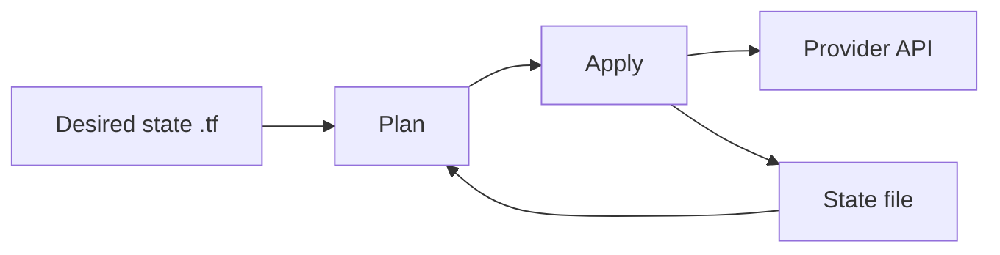

# Terraform — Declare infrastructure and let a tool converge it

| | |
|---|---|
| Levels | Beginner → Intermediate → Production |
| Time | Beginner ~30 min · full module ~4h |
| Prerequisites | [Linux](../01-linux/README.md); reading HCL is enough — no cloud account for Beginner |
| You will be able to | (1) explain desired state vs state file vs plan (2) init/plan/apply/destroy a `local_file` (3) say why you never commit `.tfstate` |

**Last verified:** 2026-08-16 · **Tested with:** Terraform 1.9+ (OpenTofu is a fine substitute; use `tofu` in place of `terraform`)

## 60-second overview

You write files that say what should exist. Terraform compares that [desired state](../docs/GLOSSARY.md) to a [state file](../docs/GLOSSARY.md) (its notebook of what it already created), shows a [plan](../docs/GLOSSARY.md), then calls a [provider](../docs/GLOSSARY.md) API to make reality match. First success uses the `local` provider and creates a file on disk. No AWS account.

## Mental model

Terraform is a building inspector with a notebook. The `.tf` files are the blueprints (desired state). The state file is the notebook of what it already built and the IDs those things have. Plan is walking the site with both in hand.



## Skip to

| Band | What you get | Go |
|---|---|---|
| Beginner | Concepts + `local_file` on your laptop | [below](#beginner-core-concepts) |
| Intermediate | Variables, outputs, a tiny module | [below](#intermediate-go-deeper) |
| Production | Remote state, pinning, workspaces, drift | [below](#production) |

## Beginner: core concepts

### Desired state (HCL)

- **What it is:** HashiCorp Configuration Language in `.tf` files. You declare the end state, not the click path.
- **Why it exists:** A second engineer (or you, next month) should get the same result from the same files.
- **How it looks:** [examples/local-file/main.tf](./examples/local-file/main.tf) — one `local_file` with a path and content.
- **Common confusion:** The `.tf` files are not a log of what ran. They are the blueprint. The log of what Terraform thinks exists is the state file.

### Providers and resources

- **What it is:** A provider is the plugin that talks to an API (`local`, `docker`, `aws`, …). A [resource](../docs/GLOSSARY.md) is one object that provider can create (`local_file`, `aws_instance`, …).
- **Why it exists:** The language stays the same; only the plugin changes when you move from a file on disk to a VM in a cloud.
- **How it looks:** [examples/local-file/versions.tf](./examples/local-file/versions.tf) pins `hashicorp/local`. `main.tf` then uses `resource "local_file" "hello"`.
- **Common confusion:** Installing the `terraform` binary does not install every provider. `terraform init` downloads the ones `required_providers` names.

### State file

- **What it is:** `terraform.tfstate` — JSON Terraform writes after apply. It stores IDs and attributes of what it created.
- **Why it exists:** The next plan has to know “this `local_file.hello` is that file on disk” (or “this `aws_instance.web` is `i-abc123`”).
- **How it looks:** After first apply, `ls terraform.tfstate` succeeds. Open it: you will see the file content and checksum.
- **Common confusion:** State is not the same as the `.tf` files. Lose the state and Terraform no longer knows what it owns. Commit the `.tf` files; never commit `*.tfstate`.

### Plan vs apply

- **What it is:** `plan` computes the diff (add / change / destroy) and prints it. `apply` executes that kind of diff and updates state.
- **Why it exists:** You review the blast radius before anything is created or deleted.
- **How it looks:** First `plan` says `1 to add`. Second `apply` says `No changes`.
- **Common confusion:** `plan` without `-out` is a preview, not a contract. In CI you save a plan file and apply *that* file.

### Idempotency / converge

- **What it is:** Apply twice with the same files and Terraform does nothing the second time. Reality already matches desired state.
- **Why it exists:** You re-run apply from CI. “No changes” is success, not a no-op you should skip forever.
- **How it looks:** First apply: `Resources: 1 added`. Second: `No changes. Your infrastructure matches the configuration.`
- **Common confusion:** If every apply still wants to replace a resource, something is not convergent (a timestamp in a name, a provider bug, or [drift](../docs/GLOSSARY.md)).

## Beginner: first success

No cloud account. The `local` provider writes a file in the example directory.

**Goal:** Create `hello.txt` with Terraform, prove a second apply is a no-op, then destroy it.  
**Time:** ~15 minutes

Install — pick one. This is a Linux-first guide; Homebrew is optional.

```bash
# Ubuntu/Debian: HashiCorp apt repo
# https://developer.hashicorp.com/terraform/install
wget -O- https://apt.releases.hashicorp.com/gpg \
  | sudo gpg --dearmor -o /usr/share/keyrings/hashicorp-archive-keyring.gpg
echo "deb [signed-by=/usr/share/keyrings/hashicorp-archive-keyring.gpg] https://apt.releases.hashicorp.com $(. /etc/os-release && echo "$VERSION_CODENAME") main" \
  | sudo tee /etc/apt/sources.list.d/hashicorp.list
sudo apt update && sudo apt install -y terraform

# Or download the linux amd64 zip from that same install page and put terraform on PATH.
# Optional on macOS: brew install terraform
terraform version
```

Then:

```bash
cd examples/local-file
terraform init
terraform plan
terraform apply -auto-approve
cat hello.txt
terraform apply -auto-approve   # no changes
ls terraform.tfstate
terraform destroy -auto-approve
```

**Expected output:** `hello.txt` contains `hello from terraform`. First apply reports `Resources: 1 added, 0 changed, 0 destroyed` and prints outputs `hello_path` / `hello_id`. Second apply prints `No changes. Your infrastructure matches the configuration.` `terraform.tfstate` exists after apply. Destroy prints `Resources: 1 destroyed` and removes `hello.txt`.

**If it failed:** `terraform: command not found` → the binary is not on `PATH`. `Failed to query available provider packages` → no network during `init` (providers are downloaded, not bundled). A leftover `hello.txt` from a previous run is fine; apply will adopt or replace it according to state.

## Intermediate: go deeper

You should already have created and destroyed [examples/local-file](./examples/local-file/).

### Variables and outputs

The same example already wires them:

- [examples/local-file/variables.tf](./examples/local-file/variables.tf) — `greeting` and `filename`, both with defaults so first success needs no flags.
- [examples/local-file/outputs.tf](./examples/local-file/outputs.tf) — path and content checksum after apply.

```bash
cd examples/local-file
terraform apply -auto-approve -var='greeting=hello again'
cat hello.txt
```

`-var`, a `*.tfvars` file, or `TF_VAR_greeting` all set the same variable. Outputs are how a later module or a human reads values out of state without opening the JSON.

### A tiny module and `for_each`

[examples/module-hello](./examples/module-hello/) wraps `local_file` in [examples/module-hello/modules/hello](./examples/module-hello/modules/hello/). The caller in [examples/module-hello/main.tf](./examples/module-hello/main.tf) uses the module once, then again with `for_each` to create `alpha.txt` and `beta.txt`.

```bash
cd examples/module-hello
terraform init
terraform apply -auto-approve
ls *.txt
terraform destroy -auto-approve
```

A module is a directory with its own variables and outputs. It is not a different language. `for_each` (or `count`) turns one block into several instances keyed by a map or set.

### Terraform vs Ansible

| | Terraform | Ansible |
|---|---|---|
| Job | Create (and destroy) infrastructure | Configure a machine that already exists |
| Memory | State file | The machine itself |
| Typical object | VPC, VM, DNS record, `local_file` | package, file, service |
| Converge by | plan/apply against state | re-running modules against the host |

Terraform creates the box. Ansible installs nginx on it. Swapping those jobs fights both tools.

### Usual next lab (not in this repo)

The common cloud follow-on is a VPC plus one EC2 instance. Use HashiCorp’s [AWS Get Started](https://developer.hashicorp.com/terraform/tutorials/aws-get-started) when you have an account. This module does not ship an AWS example and does not need keys.

## Production

**You should already be able to:** explain what the state file is for; run apply twice and get `No changes`; destroy the `local_file`.

### Remote state and locking

On a laptop, state is `terraform.tfstate` in the working directory. On a team, two applies at once will corrupt it. Put state in a backend that supports locking (S3 + DynamoDB, Terraform Cloud, GitLab, …). The backend stores the notebook; your git repo still stores only the blueprints. This module does not include a working AWS backend — configure one when you have somewhere to lock.

### Never commit tfstate

[examples/local-file/.gitignore](./examples/local-file/.gitignore) ignores `.terraform/` and `*.tfstate*`. After `init`, commit `.terraform.lock.hcl` (the provider version pin). Do not commit `terraform.tfstate`. State can contain secret-shaped values even for `local_file.content`.

### Pin provider versions

[examples/local-file/versions.tf](./examples/local-file/versions.tf) uses `required_version` and `required_providers { local = { version = "~> 2.5" } }`. Unpinned providers float under you. The lock file records the exact plugin `init` selected.

### Workspaces — and when they are the wrong tool

A [workspace](../docs/GLOSSARY.md) is a named copy of state in the same directory (`terraform workspace new staging`). It is a thin switch. It is the wrong tool when environments need different backends, different variable files, or different pipelines. Prefer separate directories (or separate CI jobs) for prod vs staging.

### `fmt`, `validate`, `plan` in CI

```bash
terraform fmt -check
terraform validate
terraform plan -out=tfplan
```

Run those on every pull request. Apply the saved plan on merge, not a fresh plan. [GitHub Actions](../05-github-actions/README.md) is the module that runs this on a git event.

### Drift

Drift is reality no longer matching state: someone edited the file (or the cloud console) by hand. `terraform plan` shows the diff. Apply writes desired state back. The failure you are preventing is “the console is the real source of truth.”

## Pitfalls

| Symptom | Likely cause | Fix |
|---|---|---|
| State missing or unreadable | Deleted `terraform.tfstate`, or two applies raced | Restore state from backup/backend; stop applying from laptops against shared infra |
| Provider version clash | Unpinned `required_providers`, or lock file ignored | Pin in `versions.tf`, commit `.terraform.lock.hcl`, re-run `init -upgrade` on purpose |
| Plan wants to change something you did not edit | Someone changed the real object (drift), or a timestamp/random value in config | `terraform plan` is the detection; stop console edits or import the change |
| Secret leaked | Password or key in a `.tf` argument (it is copied into state) | Keep secrets out of `.tf`; treat state as sensitive; use a remote backend with encryption |

## How this connects

- **Previous:** [Ansible](../08-ansible/README.md) configures the OS; [Linux](../01-linux/README.md) is what you are configuring. Terraform should have created that OS first. [Git](../02-git/README.md) — commit `.tf` files, not the state file.
- **Next:** [Kubernetes](../04-kubernetes/README.md) — later, Terraform can create a cluster (EKS and friends). [GitHub Actions](../05-github-actions/README.md) — run `fmt` / `validate` / `plan` in CI.
- **When not to use this:** Do not use Terraform to install packages on a VM — that is Ansible. Do not use Terraform as the day-to-day deploy tool for app YAML (kubectl, Helm, or GitOps).

## Practice

### Basic

1. **Setup:** First success in [examples/local-file](./examples/local-file/).  
   **Task:** Change `greeting` and apply again.  
   **Hint:** `terraform apply -auto-approve -var='greeting=edited by me'` (add a newline if you want one in the file).  
   **Success:** `hello.txt` has the new text; a third apply with the same `-var` is `No changes`.

2. **Setup:** Same directory.  
   **Task:** Add a second `local_file` resource that writes `goodbye.txt`.  
   **Hint:** Copy the existing resource block; change the label and `filename`.  
   **Success:** Apply creates `goodbye.txt`; destroy removes both files.

### Intermediate

3. **Setup:** [examples/module-hello](./examples/module-hello/).  
   **Task:** Add `"gamma"` to the `for_each` set and apply.  
   **Hint:** `toset(["alpha", "beta", "gamma"])` in [examples/module-hello/main.tf](./examples/module-hello/main.tf).  
   **Success:** `gamma.txt` exists with `hello gamma`; the next apply is `No changes`.

### Production

4. **Setup:** A `terraform.tfstate` from a local apply (create one if you destroyed it).  
   **Task:** Open the state file, find the file content inside it, and confirm `.gitignore` would hide the state from git.  
   **Hint:** Search the JSON for `hello from terraform` or your greeting. Check [examples/local-file/.gitignore](./examples/local-file/.gitignore).  
   **Success:** You can point at the field that would leak if this were a password, and `git status` does not list `*.tfstate`.

<details>
<summary>Solution sketches</summary>

1. `-var='greeting=…'` updates in place (`0 added, 1 changed` or replace, depending on the provider); then `No changes`.
2. A second `resource "local_file" "goodbye"` with `filename = "goodbye.txt"`.
3. One extra key in the set; apply adds one resource.
4. State JSON includes `content`; `.gitignore` has `*.tfstate` and `*.tfstate.*`.

</details>

## Cheat sheet

One-page commands: [cheatsheet.md](./cheatsheet.md).

## Official documentation

- [Start here: Terraform intro](https://developer.hashicorp.com/terraform/intro) — desired state, providers, the core loop.
- [Install](https://developer.hashicorp.com/terraform/install) — apt, zip, and other packages.
- [Deep reference: Language](https://developer.hashicorp.com/terraform/language) — resources, variables, modules, state, backends.
- [AWS Get Started](https://developer.hashicorp.com/terraform/tutorials/aws-get-started) — usual next lab; needs an AWS account.
