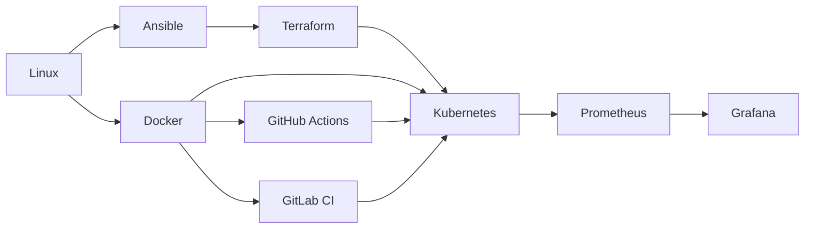

# DevOps Mastery Guide

A hands-on path from first Linux commands to shipping and observing applications. Each module teaches a **mental model**, a **15-minute first success**, then intermediate and production material you can skip until you need it.

This repo contains **nine tool modules** and **two capstone projects**. Topics listed under [Planned, not written yet](#planned-not-written-yet) are not in the tree.

## Choose a path

You do not need to scan every folder. Pick a goal. JSON for the same routes lives in [learning-paths/](./learning-paths/).

| Your goal | Start here | Path file |
|---|---|---|
| New to servers | [01. Linux](./01-linux/README.md) | [from-zero](./learning-paths/from-zero.json) |
| Ship an app (box it, run it, CI it) | [03. Docker](./03-docker/README.md) after Linux first success | [apps](./learning-paths/apps.json) |
| Configure machines | [02. Ansible](./02-ansible/README.md) after Linux first success | [machines](./learning-paths/machines.json) |
| See what you shipped | [06. Prometheus](./06-prometheus/README.md) (needs Docker) | [observe](./learning-paths/observe.json) |
| Combine the tools | [Capstones](./projects/README.md) | — |
| Look up one tool | [Module table](#modules) or [concept map](./docs/CONCEPT_MAP.md) | — |

How to study, what to install, and when to move on: [How to learn](./docs/HOW_TO_LEARN.md).

## How the nine tools fit

Linux is the OS everything else runs on. Ansible configures machines. Docker packages an app. Kubernetes runs those packages. Terraform creates the machines and clusters. GitHub Actions and GitLab CI both ship changes from a YAML pipeline in the repo. Prometheus collects numbers; Grafana shows them. Details and “which tool when”: [Concept map](./docs/CONCEPT_MAP.md).

## Modules

| # | Module | Job in one sentence | Levels |
|---|---|---|---|
| 01 | [Linux](./01-linux/README.md) | Run, inspect, and fix a Linux machine | Beginner → Advanced |
| 02 | [Ansible](./02-ansible/README.md) | Describe server setup as repeatable recipes | Beginner → Advanced |
| 03 | [Docker](./03-docker/README.md) | Package an app and its dependencies into an image | Beginner → Advanced |
| 04 | [Kubernetes](./04-kubernetes/README.md) | Run and heal many containers as one system | Beginner → Advanced |
| 05 | [Terraform](./05-terraform/README.md) | Declare infrastructure and let a tool converge it | Beginner → Advanced |
| 06 | [Prometheus](./06-prometheus/README.md) | Pull metrics on a timer and ask questions of them | Beginner → Advanced |
| 07 | [Grafana](./07-grafana/README.md) | Turn those metrics into dashboards and alerts | Beginner → Advanced |
| 08 | [GitHub Actions](./08-github-actions/README.md) | Run build, test, and deploy steps on a git event | Beginner → Advanced |
| 09 | [GitLab CI/CD](./09-gitlab/README.md) | Run build, test, and deploy steps from a YAML pipeline in the repo | Beginner → Advanced |

Recommended order: **01 → 03 → 04** for apps, with **02** and **05** when you care about machines, then **08** or **09** to ship (pick the CI system you use), then **06 → 07** to see what you shipped.

## How to use this repo

1. Clone it and open the module for your path.
2. Read the 60-second overview and the mental-model diagram. Do the **First success** before anything labeled Intermediate or Production.
3. Run the files under `examples/`. Practice is in each module’s **Practice** section. Linux, Docker, and Kubernetes also have `exercises/` files with setup, task, hint, and success. Treat them as practice, not a test.
4. Use a Linux environment (native, a VM, or WSL2). Install only what [How to learn](./docs/HOW_TO_LEARN.md) lists for the module you are on. After clone, `./scripts/preflight.sh` tells you what will run now.

Jargon is defined in the [glossary](./docs/GLOSSARY.md).

## Capstone projects

Do these after the modules they name, not instead of them.

| Project | Combines | Start when you can |
|---|---|---|
| [Full CI/CD pipeline](./projects/full-cicd-pipeline/README.md) | Docker, GitHub Actions, Kubernetes, Prometheus | Build an image, apply a Deployment, read a workflow file |
| [Terraform + Ansible + Vault](./projects/terraform-ansible-gitlab-vault/README.md) | Terraform, Ansible, secrets, GitLab CI | Write a Terraform file and an Ansible playbook locally |

Project index and prerequisites: [projects/README.md](./projects/README.md).

## Planned, not written yet

These appear in many DevOps job descriptions. They are **not** modules in this repository:

- Git workflows, bash/Python scripting, and networking as standalone courses
- GitOps (Argo CD / Flux)
- Cloud-provider DevOps (AWS / Azure / GCP)
- DevSecOps, service mesh, platform engineering

When a folder exists, it will show up in the module table above.

## Contributing and maintenance

- [Contributing](./CONTRIBUTING.md) — how to send a change
- [Module template](./docs/MODULE_TEMPLATE.md) — required shape of every module
- [Maintenance](./docs/MAINTENANCE.md) — how this repo stays current
- [AGENTS.md](./AGENTS.md) — rules for AI and human editors

## License

[MIT](./LICENSE)
