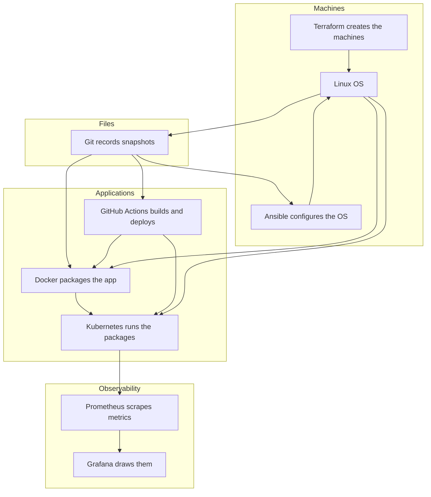

# Concept map

How the nine tools in this repo relate. Read this once after Linux, and again before a capstone.

## The system they form

- **Linux** is the computer. Everything else is a program on it (or a program that creates more of them).
- **Git** records snapshots of the files the other tools read: playbooks, Dockerfiles, manifests, Terraform, workflow YAML.
- **Ansible** repeats OS setup: packages, users, files, services.
- **Terraform** creates the computers, networks, and managed services from a desired-state file.
- **Docker** freezes an app plus its libraries into an image you can run anywhere that has a container runtime.
- **Kubernetes** keeps a desired number of those containers running, reachable, and replaceable.
- **GitHub Actions** runs commands when git events happen — usually “test, build image, deploy.”
- **Prometheus** pulls numbers from running software on a timer and stores them as time series.
- **Grafana** queries those numbers and draws graphs or fires an alert.

## Which tool when

| You need to… | Reach for | Not this |
|---|---|---|
| Debug a failing process, disk, or port on one box | Linux | Kubernetes `kubectl` first |
| Remember what changed in a Dockerfile, playbook, or workflow | Git | GitHub Actions (that *runs* on the git event) |
| Make 10 servers match the same nginx/users/ssh config | Ansible | A bash script you will not rerun safely |
| Create a VPC, VM, or cluster you can recreate | Terraform | Clicking the cloud console |
| Run the same app on your laptop and in CI | Docker | “It works on my machine” install notes |
| Keep N copies running, restart them, expose a stable name | Kubernetes | `docker run` on one host for production |
| Run tests / build / deploy on every push | GitHub Actions | Remembering to run the script |
| Know the error rate over the last 5 minutes | Prometheus | SSH and `tail` as the only signal |
| Show that error rate to humans or page someone | Grafana (or Alertmanager) | A screenshot of a terminal |

## Objects you will keep meeting

These pairs are the whole mental model. Definitions live in the [glossary](./GLOSSARY.md).

| Tool | Desired state | Memory of what exists | Unit you touch daily |
|---|---|---|---|
| Linux | files + systemd units | the running kernel | process, file, user |
| Git | files in commits | the object database (`.git`) | commit |
| Ansible | playbook + inventory | the remote machine (no local state file) | play, role |
| Docker | Dockerfile | image layers | image, container |
| Kubernetes | manifests (Deployment, Service, …) | etcd via the API server | Pod |
| Terraform | `.tf` files | the state file | resource |
| GitHub Actions | workflow YAML | run history on GitHub | job, step |
| Prometheus | scrape config / ServiceMonitor | the TSDB | time series |
| Grafana | dashboard JSON / provisioning | Grafana’s database | panel |

## Two paths through the same map

**App path (most readers):** Linux → Git → Docker → Kubernetes → GitHub Actions → Prometheus → Grafana.

You take an app, box it, run it, ship it, watch it.

**Machine path:** Linux → Git → Ansible → Terraform, then optionally Kubernetes if Terraform built a cluster.

You take a blank computer (or a cloud account), create infrastructure, then make the OS usable.

Capstones combine both paths. Do not start a capstone until you can name the objects in the table above for every tool it uses.
