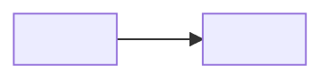

# Module template

Use this when creating or rewriting a module. Follow [AGENTS.md](../AGENTS.md).

## Folder layout

```text
XX-tool-name/
├── README.md           # required — home page, may hold all three bands if short
├── beginner.md         # only if README teaching prose would exceed ~250 lines
├── intermediate.md     # same rule
├── advanced.md         # same rule
├── cheatsheet.md       # one-page commands + objects
├── examples/           # runnable files the pages link to
└── exercises/          # one file per exercise, or keep short exercises inline
```

Do not create empty split files. Prefer one strong README until it no longer scans.

## README.md — mandatory order

Copy this skeleton. Replace angle-bracket text. Keep the heading words **Beginner**, **Intermediate**, and **Production**.

```markdown
# <Tool> — <one-line job statement>

| | |
|---|---|
| Levels | Beginner → Intermediate → Production |
| Time | Beginner ~20 min · full module ~Xh |
| Prerequisites | [linked module or skill] |
| You will be able to | (1) … (2) … (3) … |

**Last verified:** YYYY-MM-DD · **Tested with:** <tool> vX.Y

## 60-second overview

<What the tool is for, in plain language. No vendor slogans.>

## Mental model

<One analogy in a single sentence.>



## Skip to

| Band | What you get | Go |
|---|---|---|
| Beginner | Concepts + first success | [below](#beginner-core-concepts) |
| Intermediate | Worked examples, comparisons | [below](#intermediate-go-deeper) |
| Production | Security, scale, real constraints | [below](#production) |

## Beginner: core concepts

### <Concept>

- **What it is:**
- **Why it exists:**
- **How it looks:** <short snippet or command>
- **Common confusion:** <X is not Y>

(4–7 concepts. Not a term list.)

## Beginner: first success

**Goal:** <one sentence>  
**Time:** ~15 minutes

```bash
# commands
```

**Expected output:** <what “good” looks like; versions and IPs may differ>

**If it failed:** <one likely cause and the fix>

## Intermediate: go deeper

<2–3 worked examples, each linking a file under examples/. Include at least one comparison table.>

| Reach for A when… | Reach for B when… |
|---|---|

## Production

**You should already be able to:** <checklist from beginner + intermediate>

<Security, scale, state, HA. Never the first install path.>

## Pitfalls

| Symptom | Likely cause | Fix |
|---|---|---|
| | | |

## How this connects

- **Previous:** [module](../XX-prev/README.md) — <why>
- **Next:** [module](../XX-next/README.md) — <why>
- **When not to use this:** <one or two cases>

## Practice

### Basic

1. **Setup:** … **Task:** … **Hint:** … **Success:** …
2. …

### Intermediate

3. …

### Production

4. …

Optional solutions go in a `<details>` block or `exercises/`.

## Cheat sheet

<link to cheatsheet.md or a short table>

## Official documentation

- [Start here](url) — <why this page>
- [Deep reference](url) — <why this page>
```

## Patterns (copy the shape, not the words)

### Concept card

```markdown
### Inventory

- **What it is:** The list of hosts a playbook may touch, plus groups and variables.
- **Why it exists:** The same recipe should run against “web” in staging and in prod without rewriting tasks.
- **How it looks:** An `ini` or YAML file, or a script that prints JSON (dynamic inventory).
- **Common confusion:** Inventory is not the playbook. The playbook is the recipe; inventory is *who* it cooks for.
```

### First-success block

```markdown
## Beginner: first success

**Goal:** Run one container from an official image and hit it on localhost.  
**Time:** ~10 minutes

```bash
docker run --rm -d --name web -p 8080:80 nginx:1.27-alpine
curl -s -o /dev/null -w "%{http_code}\n" http://127.0.0.1:8080
docker stop web
```

**Expected output:** `200`, then the container stops.

**If it failed:** `port is already allocated` → pick `-p 8081:80`. `permission denied` → your user is not in the `docker` group; log out and back in after `usermod`.
```

### Pitfall row

```markdown
| `ImagePullBackOff` | Image name/tag wrong, or registry needs auth | `kubectl describe pod` → check `Failed to pull`; fix the tag or create an imagePullSecret |
```

### Exercise

```markdown
### Basic

1. **Setup:** Docker running; empty directory.  
   **Task:** Write a Dockerfile that serves a static `index.html` with `nginx:1.27-alpine`.  
   **Hint:** `COPY` the file into `/usr/share/nginx/html/`.  
   **Success:** `curl` to the mapped port returns your HTML.
```

## Install rule

Beginner install = simplest laptop path. Production-only: kubeadm, `kube-prometheus-stack` as the *first* Prometheus/Grafana install, Terraform Cloud, OIDC, Vault, Thanos, CIS, OPA/Gatekeeper.

## Definition of done

- Header table complete
- Mental-model mermaid present
- First success has commands, expected output, and a failure hint
- At least two files in `examples/` with relative links
- Pitfalls is a table
- Four exercises (2 basic, 1 intermediate, 1 production) with setup / task / hint / success
- No links to files that do not exist
- Production section starts with “You should already be able to”
