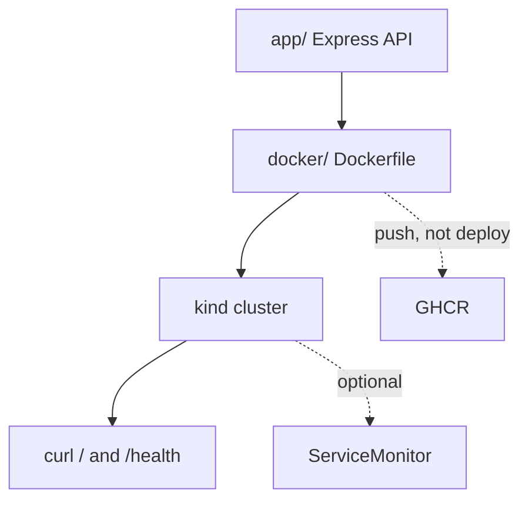

# Capstone: full CI/CD pipeline

Build a tiny API, put it in an image, run it on a local Kubernetes cluster, and see how GitHub Actions would ship the same image. Observability is optional and last.

| | |
|---|---|
| Levels | Local path = Intermediate · GitHub Actions + ServiceMonitor = Production |
| Time | ~2 hours local · another hour if you add CI and metrics |
| Prerequisites | [Git](../../09-git/README.md), [Docker](../../03-docker/README.md), [Kubernetes](../../04-kubernetes/README.md), [GitHub Actions](../../08-github-actions/README.md) beginner bands |
| You will be able to | (1) run this app in Docker (2) deploy the same image on kind (3) explain what the workflow does — and what it does *not* do |

**Last verified:** 2026-08-16

## Start when you can

- `docker build` a Dockerfile and `curl` the container
- `kubectl apply -f` a Deployment on kind and `kubectl port-forward`
- Read a workflow and name the trigger, the runner, and one step

## What you are building



This is a **one-service** learning app, not a three-tier product. The old name “3-tier” oversold it.

## Files and what each one is for

```text
full-cicd-pipeline/
├── app/                    # The software. One Express process.
│   ├── index.js            # /, /health, /metrics
│   └── package.json
├── docker/Dockerfile       # How that software becomes an image
├── k8s/
│   ├── deployment.yaml     # Keep 2 copies running
│   ├── service.yaml        # Stable name + ports http and metrics
│   └── servicemonitor.yaml # Optional. Needs Prometheus Operator.
└── .github/workflows/deploy.yml   # Build + push. Deploy step is a stub.
```

## Step 0 — run the app with Node

**Goal:** See the three HTTP paths before any container exists.

```bash
cd projects/full-cicd-pipeline/app
npm install
npm start
```

In another terminal:

```bash
curl -s http://127.0.0.1:3000/
curl -s http://127.0.0.1:3000/health
curl -s http://127.0.0.1:3000/metrics
```

**Expected output:** JSON with a message; `{"status":"healthy"}`; Prometheus text that includes `http_requests_total`.

Stop the process with Ctrl+C.

## Step 1 — same app, as an image

The Dockerfile must be built with **this directory as the context** (so `COPY app/` works):

```bash
cd projects/full-cicd-pipeline
docker build -f docker/Dockerfile -t devops-demo-app:local .
docker run --rm -d --name demo -p 3000:3000 devops-demo-app:local
curl -s http://127.0.0.1:3000/health
docker stop demo
```

**Expected output:** `{"status":"healthy"}`.

**If it failed:** `COPY app/` not found → you ran `docker build` from `docker/` with the old `COPY ../app/` paths. Use the command above. Port 3000 busy → `-p 3001:3000`.

## Step 2 — same image, on kind

```bash
kind create cluster --name learn   # skip if you already have it from module 04
kind load docker-image devops-demo-app:local --name learn
kubectl apply -f k8s/deployment.yaml -f k8s/service.yaml
kubectl wait --for=condition=available deploy/devops-demo-app --timeout=90s
kubectl port-forward svc/devops-demo-app 8080:80
```

Another terminal:

```bash
curl -s http://127.0.0.1:8080/health
curl -s http://127.0.0.1:8080/metrics
```

**Expected output:** the same JSON and metrics as Step 0. `kubectl get pods` shows two Ready pods.

**If it failed:** `ImagePullBackOff` → the node does not have `devops-demo-app:local`. Re-run `kind load` against the same cluster name. `connection refused` on 8080 → wait for Ready, or `kubectl describe pod`.

Leave `servicemonitor.yaml` for Step 4. Applying it on a cluster without the Prometheus Operator only creates a CRD error.

## Step 3 — read the GitHub Actions workflow (deploy is a stub)

Open [.github/workflows/deploy.yml](./.github/workflows/deploy.yml).

| Piece | What it does |
|---|---|
| `on.push` / `on.pull_request` to `main` | When the recipe runs |
| `docker/build-push-action` | Builds this Dockerfile and pushes to GHCR |
| **Deploy step** | Prints the image name. It does **not** call `kubectl`. |

That is honest: a learning repo cannot ship credentials to *your* cluster. The working deploy is Step 2.

To see the build job go green, copy this folder into a GitHub repo (or push this repo) and enable Actions. Packages: write is already set so GHCR push can work on `main`.

## Step 4 — optional metrics

`/metrics` is already on the app and on the Service port named `metrics`.

Only if you installed kube-prometheus-stack (Production band of [06-prometheus](../../06-prometheus/README.md)):

```bash
kubectl apply -f k8s/servicemonitor.yaml
```

Then check Prometheus targets for `devops-demo-app`. If you have not installed the Operator, skip this step.

## How this connects

- [Docker](../../03-docker/README.md) — the image
- [Kubernetes](../../04-kubernetes/README.md) — Deployment + Service
- [GitHub Actions](../../08-github-actions/README.md) — build on push
- [Prometheus](../../06-prometheus/README.md) — `/metrics` + ServiceMonitor

**When not to grow this app:** adding a database and a frontend here will hide the pipeline. Learn the path first.

## Practice

1. **Basic.** Change the JSON message in `app/index.js`, rebuild, `kind load`, and `kubectl rollout restart deploy/devops-demo-app`. Success: port-forward shows the new message.
2. **Intermediate.** Add a `/version` route that reads `process.env.APP_VERSION` and set that env var on the Deployment. Success: curl returns the value you set.
3. **Production.** List three things the stub deploy step would need before it could roll out to a real cluster (credentials, image pull, rollout check). Write them in your notes; do not invent a kubeconfig in this repo.
