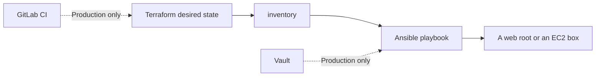

# Capstone: Terraform + Ansible + Vault

Provision (or *pretend* to provision) a server, configure it with Ansible, and only then add Vault and GitLab CI.

| | |
|---|---|
| Levels | Local path = Intermediate · AWS + Vault + GitLab = Production |
| Time | ~45 min local · several hours if you use real AWS and Vault |
| Prerequisites | [Ansible](../../08-ansible/README.md) and [Terraform](../../09-terraform/README.md) first success |
| You will be able to | (1) explain the handoff “Terraform writes inventory, Ansible uses it” (2) run the localhost playbook (3) say why this project uses GitLab when module 05 uses GitHub Actions |

**Last verified:** 2026-08-16

## Why this project uses GitLab

Module 05 teaches **GitHub Actions**. This capstone keeps a **GitLab CI** pipeline (`.gitlab-ci.yml`) on purpose: the same ideas (stages, artifacts, a manual apply) show up under a different YAML dialect.

You do **not** need a GitLab account for the local path. Treat `.gitlab-ci.yml` as a reading exercise until you have Terraform + Ansible working on your machine.

```text
GitHub Actions (module 05)     GitLab CI (this folder)
--------------------------     -----------------------
jobs: / steps:                 stages: + one key per job
actions/checkout               implicit checkout
environment:                   environment:
secrets                        CI/CD variables
```

## Start when you can

- Run the Ansible `hello.yml` first success twice and see `changed=0` the second time
- `terraform apply` the `local_file` example in module 09 and then `destroy` it

## What you are building



## Files

```text
terraform-ansible-gitlab-vault/
├── terraform/
│   ├── local-lab/          # Run this. No AWS.
│   ├── main.tf             # Real-ish AWS VPC + EC2. Do not apply blindly.
│   ├── variables.tf
│   └── outputs.tf
├── ansible/
│   ├── localhost.yml       # Run this. No Vault, no sudo required.
│   ├── inventory.localhost.ini
│   ├── playbook.yml        # Needs sudo + Vault. Production.
│   ├── files/index.html
│   └── templates/nginx.conf.j2
├── vault/                  # Policy example
├── docs/vault-setup.md     # AppRole + OIDC notes
└── .gitlab-ci.yml          # Reading + optional GitLab project
```

## Step 1 — Terraform writes an inventory (local)

```bash
cd projects/terraform-ansible-gitlab-vault/terraform/local-lab
terraform init
terraform apply -auto-approve
cat inventory.ini
```

**Expected output:** an `inventory.ini` with a fake `[web]` host. That is the handoff: Terraform’s job is to *create* (here, to *write*) something Ansible can target.

```bash
terraform destroy -auto-approve
```

The AWS files in `terraform/main.tf` are the same idea with a real provider. They need an AWS account, a current AMI, and they **cost money** (NAT gateway). Do not apply them as a first success. The default `ami-0c55b159cbfafe1f0` is a placeholder and will fail.

## Step 2 — Ansible configures a web root (local)

```bash
cd projects/terraform-ansible-gitlab-vault/ansible
ansible-playbook -i inventory.localhost.ini localhost.yml
ansible-playbook -i inventory.localhost.ini localhost.yml
```

**Expected output:** first run creates `/tmp/capstone2-www/index.html` and prints the `<h1>`. Second run `changed=0`.

**If it failed:** `ansible-playbook: command not found` → install Ansible from the [Ansible module](../../08-ansible/README.md).

Read [playbook.yml](./ansible/playbook.yml) next. It is the same shape (copy a file, template nginx) plus `become` and a Vault lookup you cannot run yet.

## Step 3 — Vault (optional, Production)

Follow [docs/vault-setup.md](./docs/vault-setup.md) only if you have a Vault server. The lookup in `playbook.yml` talks to `https://vault.example.com` and will fail until you change the URL and authenticate.

Prefer OIDC/JWT from CI over a long-lived AppRole secret, as that page says.

## Step 4 — GitLab CI (optional, Production)

[.gitlab-ci.yml](./.gitlab-ci.yml) is `validate → plan → apply (manual) → configure (manual)`.

| Job | Meaning |
|---|---|
| `validate` | `terraform init && validate` |
| `plan` | Writes a plan artifact |
| `apply` | Manual, `main`/`develop` only — uses that plan |
| `configure` | Vault login + `ansible-playbook` |

The configure job assumes variables (`VAULT_ROLE_ID`, …) and an inventory path that a real apply would produce. It is a map, not a pipeline you can green without GitLab + AWS + Vault.

## How this connects

- [Terraform](../../09-terraform/README.md) — desired state and the state file
- [Ansible](../../08-ansible/README.md) — idempotent config after the box exists
- [GitHub Actions](../../05-github-actions/README.md) — compare job shape with this `.gitlab-ci.yml`
- Capstone 1 — ships an *app* to Kubernetes; this one ships *machines*

**When not to use this stack:** configuring Kubernetes apps day-to-day. That is manifests / Helm / GitOps, not Ansible over SSH to every node.

## Practice

1. **Basic.** Change the heading in `ansible/files/index.html` and re-run `localhost.yml`. Success: `cat /tmp/capstone2-www/index.html` shows the new heading.
2. **Intermediate.** Point `local-lab` at a different `fake_host` via `-var` and apply. Success: `inventory.ini` contains the new IP.
3. **Production.** In your notes, list what you would change in `terraform/main.tf` before a real apply (AMI, SSH CIDR not `0.0.0.0/0`, remote state, no NAT if you do not need it). Do not apply to a personal paid account just to “finish” the exercise.
